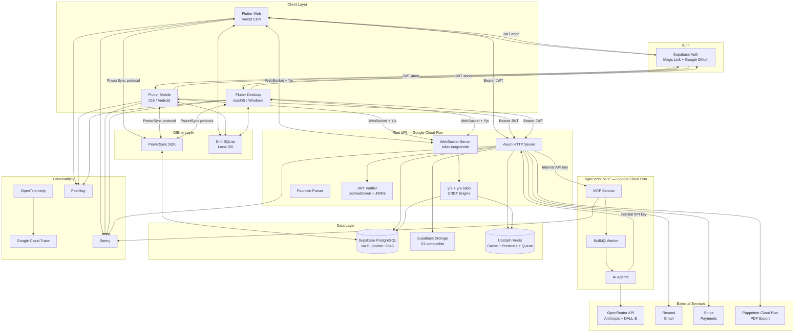
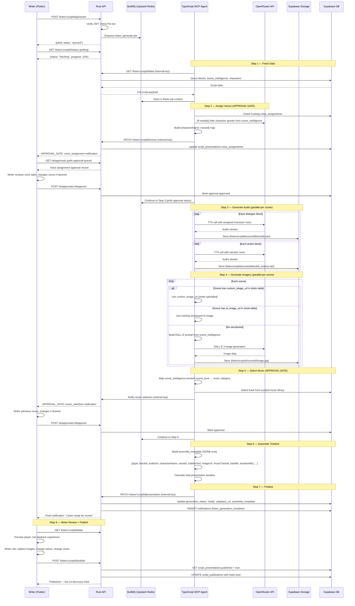

# LIPILY — Architecture Document

> This document defines the complete technical architecture for LIPILY.
> Every agent reads this document before implementing any story.
> No deviation from this architecture without a written approval in constitution.md §1.

---

## §1 — System Architecture Overview

### High-Level Architecture Diagram



### Read Path

1. Flutter client authenticates with Supabase Auth → receives JWT
2. For real-time collaborative data (blocks): Flutter ↔ Rust WebSocket (Yjs CRDT sync)
3. For offline-accessible data (scripts, scenes, blocks): Flutter ↔ PowerSync ↔ Supabase
4. For on-demand data (search, social feed, notifications): Flutter → Rust API (Bearer JWT) → Supabase query → response
5. All RLS-protected Supabase direct reads from Flutter use the `anon` key (read-only operations that RLS permits)

### Write Path

1. Flutter sends write request with Bearer JWT to Rust API
2. Rust API verifies JWT via `jsonwebtoken` crate + Supabase JWKS
3. Rust API validates request body (serde + custom validators)
4. Rust API checks rate limits via Upstash Redis
5. Rust API checks subscription tier enforcement
6. Rust API executes sqlx compile-time checked query with `service_role` scope
7. Rust API returns response
8. For AI writes: Rust API queues BullMQ job → TypeScript MCP agent processes → agent calls Rust API internal endpoint with proposed change → Rust API creates `agent_approvals` record → Flutter polls approval queue → writer approves → Rust API commits change

---

## §2 — Complete PostgreSQL Schema

```sql
-- Enable required extensions
CREATE EXTENSION IF NOT EXISTS "uuid-ossp";
CREATE EXTENSION IF NOT EXISTS "citext";
CREATE EXTENSION IF NOT EXISTS "pg_trgm";

-- ============================================================
-- ENUMS
-- ============================================================

CREATE TYPE content_source AS ENUM (
  'ai_generated', 'human_confirmed', 'human_edited', 'human_written'
);

CREATE TYPE account_type AS ENUM (
  'writer', 'producer', 'student', 'reviewer', 'admin'
);

CREATE TYPE subscription_tier AS ENUM (
  'free', 'pro', 'studio'
);

CREATE TYPE subscription_status AS ENUM (
  'active', 'past_due', 'canceled', 'trialing', 'incomplete'
);

CREATE TYPE script_format AS ENUM (
  'feature_film', 'tv_half_hour', 'tv_one_hour', 'limited_series', 'short_film', 'stage_play'
);

CREATE TYPE script_status AS ENUM (
  'draft', 'published', 'archived'
);

CREATE TYPE block_type AS ENUM (
  'scene_heading', 'action', 'character', 'dialogue',
  'parenthetical', 'transition', 'shot'
);

CREATE TYPE collaborator_role AS ENUM (
  'owner', 'lead_writer', 'editor', 'writer', 'viewer'
);

CREATE TYPE invite_status AS ENUM (
  'pending', 'accepted', 'expired', 'revoked'
);

CREATE TYPE branch_status AS ENUM (
  'active', 'submitted', 'merged', 'rejected', 'abandoned'
);

CREATE TYPE merge_request_status AS ENUM (
  'open', 'changes_requested', 'approved', 'merged', 'rejected'
);

CREATE TYPE revision_color AS ENUM (
  'white', 'blue', 'pink', 'yellow', 'green', 'goldenrod', 'buff', 'salmon'
);

CREATE TYPE story_bible_entry_type AS ENUM (
  'character', 'location', 'theme', 'backstory', 'timeline'
);

CREATE TYPE character_role AS ENUM (
  'protagonist', 'antagonist', 'supporting', 'minor', 'ensemble'
);

CREATE TYPE location_type AS ENUM (
  'interior', 'exterior', 'both'
);

CREATE TYPE script_tag_type AS ENUM (
  'prop', 'cast', 'location', 'vfx', 'stunt', 'wardrobe', 'makeup', 'vehicle'
);

CREATE TYPE visibility AS ENUM (
  'public', 'unlisted', 'invite_only', 'private'
);

CREATE TYPE generation_status AS ENUM (
  'queued', 'fetching', 'voice_assignment', 'audio_gen',
  'image_gen', 'music_select', 'assembling', 'ready', 'failed'
);

CREATE TYPE review_status AS ENUM (
  'submitted', 'assigned', 'in_review', 'complete', 'reassigned'
);

CREATE TYPE reviewer_tier AS ENUM (
  'verified_critic', 'student_reviewer'
);

CREATE TYPE notification_type AS ENUM (
  'new_collaborator_joined', 'merge_request_submitted', 'merge_request_reviewed',
  'comment_added', 'comment_reply', 'mention_in_comment', 'review_status_change',
  'review_completed', 'follower_new', 'script_liked', 'listen_generation_complete',
  'badge_earned', 'producer_contact_request', 'invite_accepted',
  'subscription_renewed', 'subscription_payment_failed'
);

CREATE TYPE report_reason AS ENUM (
  'plagiarism', 'inappropriate_content', 'copyright_violation', 'spam',
  'harassment', 'other'
);

CREATE TYPE report_status AS ENUM (
  'pending', 'reviewed', 'approved', 'removed', 'appealed'
);

CREATE TYPE agent_approval_status AS ENUM (
  'pending', 'approved', 'rejected'
);

CREATE TYPE deleted_item_type AS ENUM (
  'block', 'scene', 'script'
);

CREATE TYPE writing_session_type AS ENUM (
  'editor', 'focus_mode', 'collaboration'
);

CREATE TYPE shot_type AS ENUM (
  'wide', 'medium', 'close_up', 'extreme_close_up', 'pov', 'insert', 'establishing'
);

CREATE TYPE camera_movement AS ENUM (
  'static', 'pan', 'tilt', 'zoom', 'dolly_track', 'handheld', 'crane', 'drone'
);

CREATE TYPE page_size AS ENUM (
  'us_letter', 'a4'
);

-- ============================================================
-- PROFILES
-- ============================================================

CREATE TABLE profiles (
  id UUID PRIMARY KEY DEFAULT gen_random_uuid(),
  user_id UUID NOT NULL UNIQUE REFERENCES auth.users(id) ON DELETE CASCADE,
  username CITEXT NOT NULL UNIQUE CHECK (
    length(username) BETWEEN 3 AND 30 AND
    username ~ '^[a-zA-Z0-9_]+$'
  ),
  display_name TEXT NOT NULL CHECK (length(display_name) BETWEEN 1 AND 100),
  bio TEXT CHECK (length(bio) <= 300),
  location TEXT CHECK (length(location) <= 100),
  avatar_url TEXT CHECK (length(avatar_url) <= 2048),
  account_type account_type NOT NULL DEFAULT 'writer',
  subscription_tier subscription_tier NOT NULL DEFAULT 'free',
  is_admin BOOLEAN NOT NULL DEFAULT false,
  genre_preferences TEXT[] NOT NULL DEFAULT '{}',
  badges TEXT[] NOT NULL DEFAULT '{}',
  onboarding_complete BOOLEAN NOT NULL DEFAULT false,
  last_username_change_at TIMESTAMPTZ,
  deleted_at TIMESTAMPTZ,
  created_at TIMESTAMPTZ NOT NULL DEFAULT now(),
  updated_at TIMESTAMPTZ NOT NULL DEFAULT now()
);

CREATE INDEX idx_profiles_username ON profiles (username);
CREATE INDEX idx_profiles_user_id ON profiles (user_id);
CREATE INDEX idx_profiles_deleted_at ON profiles (deleted_at) WHERE deleted_at IS NULL;

ALTER TABLE profiles ENABLE ROW LEVEL SECURITY;

CREATE POLICY "profiles_select_own" ON profiles
  FOR SELECT USING (auth.uid() = user_id);

CREATE POLICY "profiles_select_public" ON profiles
  FOR SELECT USING (deleted_at IS NULL);

CREATE POLICY "profiles_update_own" ON profiles
  FOR UPDATE USING (auth.uid() = user_id);

-- ============================================================
-- SCRIPTS
-- ============================================================

CREATE TABLE scripts (
  id UUID PRIMARY KEY DEFAULT gen_random_uuid(),
  owner_id UUID NOT NULL REFERENCES profiles(id) ON DELETE CASCADE,
  title TEXT NOT NULL CHECK (length(title) BETWEEN 1 AND 200),
  format script_format NOT NULL DEFAULT 'feature_film',
  fountain_content TEXT,
  yjs_snapshot BYTEA,
  word_count INTEGER NOT NULL DEFAULT 0 CHECK (word_count >= 0),
  scene_count INTEGER NOT NULL DEFAULT 0 CHECK (scene_count >= 0),
  page_count_estimate INTEGER NOT NULL DEFAULT 0 CHECK (page_count_estimate >= 0),
  language TEXT NOT NULL DEFAULT 'en' CHECK (length(language) <= 10),
  rtl BOOLEAN NOT NULL DEFAULT false,
  status script_status NOT NULL DEFAULT 'draft',
  is_revision_mode BOOLEAN NOT NULL DEFAULT false,
  current_revision_color revision_color NOT NULL DEFAULT 'white',
  deleted_at TIMESTAMPTZ,
  created_at TIMESTAMPTZ NOT NULL DEFAULT now(),
  updated_at TIMESTAMPTZ NOT NULL DEFAULT now()
);

CREATE INDEX idx_scripts_owner_id ON scripts (owner_id);
CREATE INDEX idx_scripts_status ON scripts (status);
CREATE INDEX idx_scripts_deleted_at ON scripts (deleted_at) WHERE deleted_at IS NULL;
CREATE INDEX idx_scripts_title_trgm ON scripts USING gin (title gin_trgm_ops);

ALTER TABLE scripts ENABLE ROW LEVEL SECURITY;

CREATE POLICY "scripts_select_owner" ON scripts
  FOR SELECT USING (
    auth.uid() IN (SELECT user_id FROM profiles WHERE id = owner_id)
    AND deleted_at IS NULL
  );

CREATE POLICY "scripts_select_collaborator" ON scripts
  FOR SELECT USING (
    auth.uid() IN (
      SELECT p.user_id FROM profiles p
      JOIN collaborators c ON c.user_id = p.id
      WHERE c.script_id = scripts.id AND c.accepted_at IS NOT NULL
    )
    AND deleted_at IS NULL
  );

CREATE POLICY "scripts_insert_own" ON scripts
  FOR INSERT WITH CHECK (
    auth.uid() IN (SELECT user_id FROM profiles WHERE id = owner_id)
  );

CREATE POLICY "scripts_update_owner" ON scripts
  FOR UPDATE USING (
    auth.uid() IN (SELECT user_id FROM profiles WHERE id = owner_id)
  );

-- ============================================================
-- SCENES
-- ============================================================

CREATE TABLE scenes (
  id UUID PRIMARY KEY DEFAULT gen_random_uuid(),
  script_id UUID NOT NULL REFERENCES scripts(id) ON DELETE CASCADE,
  heading TEXT NOT NULL CHECK (length(heading) <= 500),
  position INTEGER NOT NULL CHECK (position > 0),
  color_tag TEXT CHECK (color_tag ~ '^#[0-9A-Fa-f]{6}$'),
  is_omitted BOOLEAN NOT NULL DEFAULT false,
  is_locked BOOLEAN NOT NULL DEFAULT false,
  locked_by UUID REFERENCES profiles(id),
  assigned_to UUID REFERENCES profiles(id),
  deleted_at TIMESTAMPTZ,
  created_at TIMESTAMPTZ NOT NULL DEFAULT now(),
  updated_at TIMESTAMPTZ NOT NULL DEFAULT now()
);

CREATE INDEX idx_scenes_script_id ON scenes (script_id);
CREATE INDEX idx_scenes_position ON scenes (script_id, position);
CREATE INDEX idx_scenes_deleted_at ON scenes (deleted_at) WHERE deleted_at IS NULL;
CREATE INDEX idx_scenes_heading_trgm ON scenes USING gin (heading gin_trgm_ops);

ALTER TABLE scenes ENABLE ROW LEVEL SECURITY;

CREATE POLICY "scenes_select_script_access" ON scenes
  FOR SELECT USING (
    script_id IN (
      SELECT id FROM scripts WHERE
        auth.uid() IN (SELECT user_id FROM profiles WHERE id = owner_id)
        OR auth.uid() IN (
          SELECT p.user_id FROM profiles p
          JOIN collaborators c ON c.user_id = p.id
          WHERE c.script_id = scripts.id AND c.accepted_at IS NOT NULL
        )
    ) AND deleted_at IS NULL
  );

CREATE POLICY "scenes_insert_script_access" ON scenes
  FOR INSERT WITH CHECK (
    script_id IN (
      SELECT id FROM scripts WHERE
        auth.uid() IN (SELECT user_id FROM profiles WHERE id = owner_id)
    )
  );

CREATE POLICY "scenes_update_script_access" ON scenes
  FOR UPDATE USING (
    script_id IN (
      SELECT id FROM scripts WHERE
        auth.uid() IN (SELECT user_id FROM profiles WHERE id = owner_id)
    )
  );

-- ============================================================
-- BLOCKS
-- ============================================================

CREATE TABLE blocks (
  id UUID PRIMARY KEY DEFAULT gen_random_uuid(),
  scene_id UUID NOT NULL REFERENCES scenes(id) ON DELETE CASCADE,
  script_id UUID NOT NULL REFERENCES scripts(id) ON DELETE CASCADE,
  type block_type NOT NULL,
  content TEXT NOT NULL DEFAULT '' CHECK (length(content) <= 10000),
  position INTEGER NOT NULL CHECK (position > 0),
  metadata JSONB NOT NULL DEFAULT '{}',
  content_source content_source NOT NULL DEFAULT 'human_written',
  deleted_at TIMESTAMPTZ,
  created_at TIMESTAMPTZ NOT NULL DEFAULT now(),
  updated_at TIMESTAMPTZ NOT NULL DEFAULT now()
);

CREATE INDEX idx_blocks_scene_id ON blocks (scene_id);
CREATE INDEX idx_blocks_script_id ON blocks (script_id);
CREATE INDEX idx_blocks_position ON blocks (scene_id, position);
CREATE INDEX idx_blocks_deleted_at ON blocks (deleted_at) WHERE deleted_at IS NULL;
CREATE INDEX idx_blocks_content_trgm ON blocks USING gin (content gin_trgm_ops);
CREATE INDEX idx_blocks_type ON blocks (type);

ALTER TABLE blocks ENABLE ROW LEVEL SECURITY;

CREATE POLICY "blocks_select_script_access" ON blocks
  FOR SELECT USING (
    script_id IN (
      SELECT id FROM scripts WHERE
        auth.uid() IN (SELECT user_id FROM profiles WHERE id = owner_id)
        OR auth.uid() IN (
          SELECT p.user_id FROM profiles p
          JOIN collaborators c ON c.user_id = p.id
          WHERE c.script_id = scripts.id AND c.accepted_at IS NOT NULL
        )
    ) AND deleted_at IS NULL
  );

CREATE POLICY "blocks_insert_script_access" ON blocks
  FOR INSERT WITH CHECK (
    script_id IN (
      SELECT id FROM scripts WHERE
        auth.uid() IN (SELECT user_id FROM profiles WHERE id = owner_id)
        OR auth.uid() IN (
          SELECT p.user_id FROM profiles p
          JOIN collaborators c ON c.user_id = p.id
          WHERE c.script_id = scripts.id
          AND c.accepted_at IS NOT NULL
          AND c.role IN ('owner', 'lead_writer', 'editor', 'writer')
        )
    )
  );

CREATE POLICY "blocks_update_script_access" ON blocks
  FOR UPDATE USING (
    script_id IN (
      SELECT id FROM scripts WHERE
        auth.uid() IN (SELECT user_id FROM profiles WHERE id = owner_id)
        OR auth.uid() IN (
          SELECT p.user_id FROM profiles p
          JOIN collaborators c ON c.user_id = p.id
          WHERE c.script_id = scripts.id
          AND c.accepted_at IS NOT NULL
          AND c.role IN ('owner', 'lead_writer', 'editor', 'writer')
        )
    )
  );

-- ============================================================
-- SCENE INTELLIGENCE
-- ============================================================

CREATE TABLE scene_intelligence (
  id UUID PRIMARY KEY DEFAULT gen_random_uuid(),
  scene_id UUID NOT NULL UNIQUE REFERENCES scenes(id) ON DELETE CASCADE,
  script_id UUID NOT NULL REFERENCES scripts(id) ON DELETE CASCADE,
  environment JSONB NOT NULL DEFAULT '{}',
  props JSONB NOT NULL DEFAULT '[]',
  characters JSONB NOT NULL DEFAULT '[]',
  music JSONB NOT NULL DEFAULT '{}',
  emotion JSONB NOT NULL DEFAULT '{}',
  last_extracted_at TIMESTAMPTZ,
  extraction_model TEXT CHECK (length(extraction_model) <= 100),
  created_at TIMESTAMPTZ NOT NULL DEFAULT now(),
  updated_at TIMESTAMPTZ NOT NULL DEFAULT now()
);

CREATE INDEX idx_scene_intelligence_script_id ON scene_intelligence (script_id);
CREATE INDEX idx_scene_intelligence_scene_id ON scene_intelligence (scene_id);

ALTER TABLE scene_intelligence ENABLE ROW LEVEL SECURITY;

CREATE POLICY "scene_intelligence_select_access" ON scene_intelligence
  FOR SELECT USING (
    script_id IN (
      SELECT id FROM scripts WHERE
        auth.uid() IN (SELECT user_id FROM profiles WHERE id = owner_id)
        OR auth.uid() IN (
          SELECT p.user_id FROM profiles p
          JOIN collaborators c ON c.user_id = p.id
          WHERE c.script_id = scripts.id AND c.accepted_at IS NOT NULL
        )
    )
  );

CREATE POLICY "scene_intelligence_upsert_access" ON scene_intelligence
  FOR ALL USING (
    script_id IN (
      SELECT id FROM scripts WHERE
        auth.uid() IN (SELECT user_id FROM profiles WHERE id = owner_id)
    )
  );

-- ============================================================
-- STORY BIBLE ENTRIES
-- ============================================================

CREATE TABLE story_bible_entries (
  id UUID PRIMARY KEY DEFAULT gen_random_uuid(),
  script_id UUID NOT NULL REFERENCES scripts(id) ON DELETE CASCADE,
  type story_bible_entry_type NOT NULL,
  title TEXT NOT NULL CHECK (length(title) BETWEEN 1 AND 200),
  content TEXT NOT NULL DEFAULT '' CHECK (length(content) <= 50000),
  metadata JSONB NOT NULL DEFAULT '{}',
  position INTEGER NOT NULL DEFAULT 1000 CHECK (position > 0),
  content_source content_source NOT NULL DEFAULT 'human_written',
  deleted_at TIMESTAMPTZ,
  created_at TIMESTAMPTZ NOT NULL DEFAULT now(),
  updated_at TIMESTAMPTZ NOT NULL DEFAULT now()
);

CREATE INDEX idx_story_bible_entries_script_id ON story_bible_entries (script_id);
CREATE INDEX idx_story_bible_entries_type ON story_bible_entries (script_id, type);

ALTER TABLE story_bible_entries ENABLE ROW LEVEL SECURITY;

CREATE POLICY "story_bible_entries_access" ON story_bible_entries
  FOR ALL USING (
    script_id IN (
      SELECT id FROM scripts WHERE
        auth.uid() IN (SELECT user_id FROM profiles WHERE id = owner_id)
        OR auth.uid() IN (
          SELECT p.user_id FROM profiles p
          JOIN collaborators c ON c.user_id = p.id
          WHERE c.script_id = scripts.id AND c.accepted_at IS NOT NULL
        )
    ) AND deleted_at IS NULL
  );

-- ============================================================
-- BEAT NOTES
-- ============================================================

CREATE TABLE beat_notes (
  id UUID PRIMARY KEY DEFAULT gen_random_uuid(),
  scene_id UUID NOT NULL REFERENCES scenes(id) ON DELETE CASCADE,
  script_id UUID NOT NULL REFERENCES scripts(id) ON DELETE CASCADE,
  summary TEXT CHECK (length(summary) <= 200),
  emotional_beat TEXT CHECK (length(emotional_beat) <= 100),
  structural_tag TEXT CHECK (length(structural_tag) <= 100),
  content_source content_source NOT NULL DEFAULT 'human_written',
  created_at TIMESTAMPTZ NOT NULL DEFAULT now(),
  updated_at TIMESTAMPTZ NOT NULL DEFAULT now()
);

CREATE INDEX idx_beat_notes_script_id ON beat_notes (script_id);
CREATE INDEX idx_beat_notes_scene_id ON beat_notes (scene_id);

ALTER TABLE beat_notes ENABLE ROW LEVEL SECURITY;

CREATE POLICY "beat_notes_access" ON beat_notes
  FOR ALL USING (
    script_id IN (
      SELECT id FROM scripts WHERE
        auth.uid() IN (SELECT user_id FROM profiles WHERE id = owner_id)
        OR auth.uid() IN (
          SELECT p.user_id FROM profiles p
          JOIN collaborators c ON c.user_id = p.id
          WHERE c.script_id = scripts.id AND c.accepted_at IS NOT NULL
        )
    )
  );

-- ============================================================
-- COLLABORATORS
-- ============================================================

CREATE TABLE collaborators (
  id UUID PRIMARY KEY DEFAULT gen_random_uuid(),
  script_id UUID NOT NULL REFERENCES scripts(id) ON DELETE CASCADE,
  user_id UUID NOT NULL REFERENCES profiles(id) ON DELETE CASCADE,
  role collaborator_role NOT NULL DEFAULT 'viewer',
  invited_at TIMESTAMPTZ NOT NULL DEFAULT now(),
  accepted_at TIMESTAMPTZ,
  UNIQUE (script_id, user_id)
);

CREATE INDEX idx_collaborators_script_id ON collaborators (script_id);
CREATE INDEX idx_collaborators_user_id ON collaborators (user_id);

ALTER TABLE collaborators ENABLE ROW LEVEL SECURITY;

CREATE POLICY "collaborators_select_access" ON collaborators
  FOR SELECT USING (
    script_id IN (
      SELECT id FROM scripts WHERE
        auth.uid() IN (SELECT user_id FROM profiles WHERE id = owner_id)
    )
    OR auth.uid() IN (SELECT user_id FROM profiles WHERE id = user_id)
  );

CREATE POLICY "collaborators_insert_owner" ON collaborators
  FOR INSERT WITH CHECK (
    script_id IN (
      SELECT id FROM scripts WHERE
        auth.uid() IN (SELECT user_id FROM profiles WHERE id = owner_id)
    )
  );

-- ============================================================
-- INVITES
-- ============================================================

CREATE TABLE invites (
  id UUID PRIMARY KEY DEFAULT gen_random_uuid(),
  script_id UUID NOT NULL REFERENCES scripts(id) ON DELETE CASCADE,
  inviter_id UUID NOT NULL REFERENCES profiles(id) ON DELETE CASCADE,
  email CITEXT NOT NULL CHECK (length(email) <= 254),
  role collaborator_role NOT NULL DEFAULT 'viewer',
  token TEXT NOT NULL UNIQUE CHECK (length(token) <= 512),
  expires_at TIMESTAMPTZ NOT NULL,
  accepted_at TIMESTAMPTZ,
  status invite_status NOT NULL DEFAULT 'pending',
  created_at TIMESTAMPTZ NOT NULL DEFAULT now()
);

CREATE INDEX idx_invites_script_id ON invites (script_id);
CREATE INDEX idx_invites_email ON invites (email);
CREATE INDEX idx_invites_token ON invites (token);

ALTER TABLE invites ENABLE ROW LEVEL SECURITY;

CREATE POLICY "invites_select_owner" ON invites
  FOR SELECT USING (
    script_id IN (
      SELECT id FROM scripts WHERE
        auth.uid() IN (SELECT user_id FROM profiles WHERE id = owner_id)
    )
  );

CREATE POLICY "invites_insert_owner" ON invites
  FOR INSERT WITH CHECK (
    script_id IN (
      SELECT id FROM scripts WHERE
        auth.uid() IN (SELECT user_id FROM profiles WHERE id = owner_id)
    )
  );

-- ============================================================
-- COMMENTS
-- ============================================================

CREATE TABLE comments (
  id UUID PRIMARY KEY DEFAULT gen_random_uuid(),
  block_id UUID NOT NULL REFERENCES blocks(id) ON DELETE CASCADE,
  script_id UUID NOT NULL REFERENCES scripts(id) ON DELETE CASCADE,
  author_id UUID NOT NULL REFERENCES profiles(id) ON DELETE CASCADE,
  content TEXT NOT NULL CHECK (length(content) BETWEEN 1 AND 2000),
  parent_id UUID REFERENCES comments(id) ON DELETE CASCADE,
  resolved_at TIMESTAMPTZ,
  resolved_by UUID REFERENCES profiles(id),
  created_at TIMESTAMPTZ NOT NULL DEFAULT now(),
  updated_at TIMESTAMPTZ NOT NULL DEFAULT now()
);

CREATE INDEX idx_comments_block_id ON comments (block_id);
CREATE INDEX idx_comments_script_id ON comments (script_id);
CREATE INDEX idx_comments_parent_id ON comments (parent_id);

ALTER TABLE comments ENABLE ROW LEVEL SECURITY;

CREATE POLICY "comments_access" ON comments
  FOR ALL USING (
    script_id IN (
      SELECT id FROM scripts WHERE
        auth.uid() IN (SELECT user_id FROM profiles WHERE id = owner_id)
        OR auth.uid() IN (
          SELECT p.user_id FROM profiles p
          JOIN collaborators c ON c.user_id = p.id
          WHERE c.script_id = scripts.id AND c.accepted_at IS NOT NULL
        )
    )
  );

-- ============================================================
-- DRAFTS
-- ============================================================

CREATE TABLE drafts (
  id UUID PRIMARY KEY DEFAULT gen_random_uuid(),
  script_id UUID NOT NULL REFERENCES scripts(id) ON DELETE CASCADE,
  created_by UUID NOT NULL REFERENCES profiles(id) ON DELETE CASCADE,
  name TEXT NOT NULL CHECK (length(name) BETWEEN 1 AND 200),
  revision_color revision_color NOT NULL DEFAULT 'white',
  fountain_snapshot TEXT,
  block_count INTEGER NOT NULL DEFAULT 0 CHECK (block_count >= 0),
  page_count_estimate INTEGER NOT NULL DEFAULT 0 CHECK (page_count_estimate >= 0),
  is_autosave BOOLEAN NOT NULL DEFAULT false,
  created_at TIMESTAMPTZ NOT NULL DEFAULT now()
);

CREATE INDEX idx_drafts_script_id ON drafts (script_id);
CREATE INDEX idx_drafts_created_at ON drafts (script_id, created_at DESC);
CREATE INDEX idx_drafts_is_autosave ON drafts (script_id, is_autosave);

ALTER TABLE drafts ENABLE ROW LEVEL SECURITY;

CREATE POLICY "drafts_access" ON drafts
  FOR ALL USING (
    script_id IN (
      SELECT id FROM scripts WHERE
        auth.uid() IN (SELECT user_id FROM profiles WHERE id = owner_id)
    )
  );

-- ============================================================
-- BRANCHES
-- ============================================================

CREATE TABLE branches (
  id UUID PRIMARY KEY DEFAULT gen_random_uuid(),
  script_id UUID NOT NULL REFERENCES scripts(id) ON DELETE CASCADE,
  name TEXT NOT NULL CHECK (length(name) BETWEEN 1 AND 200),
  created_by UUID NOT NULL REFERENCES profiles(id) ON DELETE CASCADE,
  base_draft_id UUID REFERENCES drafts(id),
  status branch_status NOT NULL DEFAULT 'active',
  fountain_snapshot TEXT,
  created_at TIMESTAMPTZ NOT NULL DEFAULT now(),
  updated_at TIMESTAMPTZ NOT NULL DEFAULT now()
);

CREATE INDEX idx_branches_script_id ON branches (script_id);
CREATE INDEX idx_branches_status ON branches (script_id, status);

ALTER TABLE branches ENABLE ROW LEVEL SECURITY;

CREATE POLICY "branches_access" ON branches
  FOR ALL USING (
    script_id IN (
      SELECT id FROM scripts WHERE
        auth.uid() IN (SELECT user_id FROM profiles WHERE id = owner_id)
        OR auth.uid() IN (
          SELECT p.user_id FROM profiles p
          JOIN collaborators c ON c.user_id = p.id
          WHERE c.script_id = scripts.id
          AND c.accepted_at IS NOT NULL
          AND c.role IN ('owner', 'lead_writer', 'editor', 'writer')
        )
    )
  );

-- ============================================================
-- MERGE REQUESTS
-- ============================================================

CREATE TABLE merge_requests (
  id UUID PRIMARY KEY DEFAULT gen_random_uuid(),
  branch_id UUID NOT NULL REFERENCES branches(id) ON DELETE CASCADE,
  script_id UUID NOT NULL REFERENCES scripts(id) ON DELETE CASCADE,
  submitted_by UUID NOT NULL REFERENCES profiles(id) ON DELETE CASCADE,
  reviewer_id UUID REFERENCES profiles(id),
  status merge_request_status NOT NULL DEFAULT 'open',
  review_comments JSONB NOT NULL DEFAULT '[]',
  merged_at TIMESTAMPTZ,
  rejected_at TIMESTAMPTZ,
  created_at TIMESTAMPTZ NOT NULL DEFAULT now(),
  updated_at TIMESTAMPTZ NOT NULL DEFAULT now()
);

CREATE INDEX idx_merge_requests_script_id ON merge_requests (script_id);
CREATE INDEX idx_merge_requests_branch_id ON merge_requests (branch_id);
CREATE INDEX idx_merge_requests_status ON merge_requests (script_id, status);

ALTER TABLE merge_requests ENABLE ROW LEVEL SECURITY;

CREATE POLICY "merge_requests_access" ON merge_requests
  FOR ALL USING (
    script_id IN (
      SELECT id FROM scripts WHERE
        auth.uid() IN (SELECT user_id FROM profiles WHERE id = owner_id)
        OR auth.uid() IN (
          SELECT p.user_id FROM profiles p
          JOIN collaborators c ON c.user_id = p.id
          WHERE c.script_id = scripts.id AND c.accepted_at IS NOT NULL
        )
    )
  );

-- ============================================================
-- SCRIPT TAGS
-- ============================================================

CREATE TABLE script_tags (
  id UUID PRIMARY KEY DEFAULT gen_random_uuid(),
  block_id UUID NOT NULL REFERENCES blocks(id) ON DELETE CASCADE,
  scene_id UUID NOT NULL REFERENCES scenes(id) ON DELETE CASCADE,
  script_id UUID NOT NULL REFERENCES scripts(id) ON DELETE CASCADE,
  tag_type script_tag_type NOT NULL,
  tagged_text TEXT NOT NULL CHECK (length(tagged_text) BETWEEN 1 AND 500),
  position_start INTEGER NOT NULL CHECK (position_start >= 0),
  position_end INTEGER NOT NULL CHECK (position_end > position_start),
  created_by UUID NOT NULL REFERENCES profiles(id),
  created_at TIMESTAMPTZ NOT NULL DEFAULT now()
);

CREATE INDEX idx_script_tags_script_id ON script_tags (script_id);
CREATE INDEX idx_script_tags_scene_id ON script_tags (scene_id);
CREATE INDEX idx_script_tags_block_id ON script_tags (block_id);
CREATE INDEX idx_script_tags_type ON script_tags (script_id, tag_type);

ALTER TABLE script_tags ENABLE ROW LEVEL SECURITY;

CREATE POLICY "script_tags_access" ON script_tags
  FOR ALL USING (
    script_id IN (
      SELECT id FROM scripts WHERE
        auth.uid() IN (SELECT user_id FROM profiles WHERE id = owner_id)
        OR auth.uid() IN (
          SELECT p.user_id FROM profiles p
          JOIN collaborators c ON c.user_id = p.id
          WHERE c.script_id = scripts.id AND c.accepted_at IS NOT NULL
        )
    )
  );

-- ============================================================
-- CHARACTERS
-- ============================================================

CREATE TABLE characters (
  id UUID PRIMARY KEY DEFAULT gen_random_uuid(),
  script_id UUID NOT NULL REFERENCES scripts(id) ON DELETE CASCADE,
  name TEXT NOT NULL CHECK (length(name) BETWEEN 1 AND 200),
  aliases TEXT[] NOT NULL DEFAULT '{}',
  role character_role NOT NULL DEFAULT 'supporting',
  description TEXT CHECK (length(description) <= 2000),
  age_range TEXT CHECK (length(age_range) <= 50),
  arc_summary TEXT CHECK (length(arc_summary) <= 2000),
  voice_notes TEXT CHECK (length(voice_notes) <= 2000),
  key_traits TEXT[] NOT NULL DEFAULT '{}',
  first_scene_id UUID REFERENCES scenes(id),
  content_source content_source NOT NULL DEFAULT 'human_written',
  deleted_at TIMESTAMPTZ,
  created_at TIMESTAMPTZ NOT NULL DEFAULT now(),
  updated_at TIMESTAMPTZ NOT NULL DEFAULT now()
);

CREATE INDEX idx_characters_script_id ON characters (script_id);
CREATE INDEX idx_characters_name ON characters (script_id, name);

ALTER TABLE characters ENABLE ROW LEVEL SECURITY;

CREATE POLICY "characters_access" ON characters
  FOR ALL USING (
    script_id IN (
      SELECT id FROM scripts WHERE
        auth.uid() IN (SELECT user_id FROM profiles WHERE id = owner_id)
        OR auth.uid() IN (
          SELECT p.user_id FROM profiles p
          JOIN collaborators c ON c.user_id = p.id
          WHERE c.script_id = scripts.id AND c.accepted_at IS NOT NULL
        )
    ) AND deleted_at IS NULL
  );

-- ============================================================
-- LOCATIONS
-- ============================================================

CREATE TABLE locations (
  id UUID PRIMARY KEY DEFAULT gen_random_uuid(),
  script_id UUID NOT NULL REFERENCES scripts(id) ON DELETE CASCADE,
  name TEXT NOT NULL CHECK (length(name) BETWEEN 1 AND 200),
  type location_type NOT NULL DEFAULT 'interior',
  description TEXT CHECK (length(description) <= 2000),
  atmosphere_notes TEXT CHECK (length(atmosphere_notes) <= 1000),
  content_source content_source NOT NULL DEFAULT 'human_written',
  deleted_at TIMESTAMPTZ,
  created_at TIMESTAMPTZ NOT NULL DEFAULT now(),
  updated_at TIMESTAMPTZ NOT NULL DEFAULT now()
);

CREATE INDEX idx_locations_script_id ON locations (script_id);
CREATE INDEX idx_locations_name ON locations (script_id, name);

ALTER TABLE locations ENABLE ROW LEVEL SECURITY;

CREATE POLICY "locations_access" ON locations
  FOR ALL USING (
    script_id IN (
      SELECT id FROM scripts WHERE
        auth.uid() IN (SELECT user_id FROM profiles WHERE id = owner_id)
        OR auth.uid() IN (
          SELECT p.user_id FROM profiles p
          JOIN collaborators c ON c.user_id = p.id
          WHERE c.script_id = scripts.id AND c.accepted_at IS NOT NULL
        )
    ) AND deleted_at IS NULL
  );

-- ============================================================
-- AI USAGE
-- ============================================================

CREATE TABLE ai_usage (
  id UUID PRIMARY KEY DEFAULT gen_random_uuid(),
  user_id UUID NOT NULL REFERENCES profiles(id) ON DELETE CASCADE,
  script_id UUID REFERENCES scripts(id) ON DELETE SET NULL,
  feature_type TEXT NOT NULL CHECK (length(feature_type) <= 100),
  model_used TEXT NOT NULL CHECK (length(model_used) <= 100),
  tokens_used INTEGER NOT NULL DEFAULT 0 CHECK (tokens_used >= 0),
  created_at TIMESTAMPTZ NOT NULL DEFAULT now()
);

CREATE INDEX idx_ai_usage_user_id ON ai_usage (user_id);
CREATE INDEX idx_ai_usage_created_at ON ai_usage (user_id, created_at DESC);
CREATE INDEX idx_ai_usage_daily ON ai_usage (user_id, date_trunc('day', created_at));

ALTER TABLE ai_usage ENABLE ROW LEVEL SECURITY;

CREATE POLICY "ai_usage_own" ON ai_usage
  FOR SELECT USING (auth.uid() IN (SELECT user_id FROM profiles WHERE id = user_id));

-- ============================================================
-- AGENT APPROVALS
-- ============================================================

CREATE TABLE agent_approvals (
  id UUID PRIMARY KEY DEFAULT gen_random_uuid(),
  user_id UUID NOT NULL REFERENCES profiles(id) ON DELETE CASCADE,
  script_id UUID NOT NULL REFERENCES scripts(id) ON DELETE CASCADE,
  agent_type TEXT NOT NULL CHECK (length(agent_type) <= 100),
  proposed_change JSONB NOT NULL DEFAULT '{}',
  status agent_approval_status NOT NULL DEFAULT 'pending',
  approved_at TIMESTAMPTZ,
  rejected_at TIMESTAMPTZ,
  created_at TIMESTAMPTZ NOT NULL DEFAULT now()
);

CREATE INDEX idx_agent_approvals_user_id ON agent_approvals (user_id);
CREATE INDEX idx_agent_approvals_script_id ON agent_approvals (script_id);
CREATE INDEX idx_agent_approvals_status ON agent_approvals (user_id, status);

ALTER TABLE agent_approvals ENABLE ROW LEVEL SECURITY;

CREATE POLICY "agent_approvals_own" ON agent_approvals
  FOR ALL USING (auth.uid() IN (SELECT user_id FROM profiles WHERE id = user_id));

-- ============================================================
-- SUBSCRIPTIONS
-- ============================================================

CREATE TABLE subscriptions (
  id UUID PRIMARY KEY DEFAULT gen_random_uuid(),
  user_id UUID NOT NULL UNIQUE REFERENCES profiles(id) ON DELETE CASCADE,
  stripe_customer_id TEXT NOT NULL UNIQUE CHECK (length(stripe_customer_id) <= 255),
  stripe_subscription_id TEXT UNIQUE CHECK (length(stripe_subscription_id) <= 255),
  tier subscription_tier NOT NULL DEFAULT 'free',
  status subscription_status NOT NULL DEFAULT 'active',
  current_period_end TIMESTAMPTZ,
  cancel_at_period_end BOOLEAN NOT NULL DEFAULT false,
  created_at TIMESTAMPTZ NOT NULL DEFAULT now(),
  updated_at TIMESTAMPTZ NOT NULL DEFAULT now()
);

CREATE INDEX idx_subscriptions_user_id ON subscriptions (user_id);
CREATE INDEX idx_subscriptions_stripe_customer ON subscriptions (stripe_customer_id);

ALTER TABLE subscriptions ENABLE ROW LEVEL SECURITY;

CREATE POLICY "subscriptions_own" ON subscriptions
  FOR SELECT USING (auth.uid() IN (SELECT user_id FROM profiles WHERE id = user_id));

-- ============================================================
-- SCRIPT PUBLICATIONS
-- ============================================================

CREATE TABLE script_publications (
  id UUID PRIMARY KEY DEFAULT gen_random_uuid(),
  script_id UUID NOT NULL UNIQUE REFERENCES scripts(id) ON DELETE CASCADE,
  user_id UUID NOT NULL REFERENCES profiles(id) ON DELETE CASCADE,
  genres TEXT[] NOT NULL DEFAULT '{}',
  logline TEXT CHECK (length(logline) <= 250),
  tags TEXT[] NOT NULL DEFAULT '{}',
  visibility visibility NOT NULL DEFAULT 'public',
  published_at TIMESTAMPTZ,
  view_count INTEGER NOT NULL DEFAULT 0 CHECK (view_count >= 0),
  like_count INTEGER NOT NULL DEFAULT 0 CHECK (like_count >= 0),
  bookmark_count INTEGER NOT NULL DEFAULT 0 CHECK (bookmark_count >= 0),
  auto_hidden BOOLEAN NOT NULL DEFAULT false,
  reviewed_badge BOOLEAN NOT NULL DEFAULT false,
  created_at TIMESTAMPTZ NOT NULL DEFAULT now(),
  updated_at TIMESTAMPTZ NOT NULL DEFAULT now()
);

CREATE INDEX idx_script_publications_user_id ON script_publications (user_id);
CREATE INDEX idx_script_publications_published ON script_publications (published_at DESC) WHERE published_at IS NOT NULL;
CREATE INDEX idx_script_publications_visibility ON script_publications (visibility);
CREATE INDEX idx_script_publications_genres ON script_publications USING gin (genres);

ALTER TABLE script_publications ENABLE ROW LEVEL SECURITY;

CREATE POLICY "script_publications_select_public" ON script_publications
  FOR SELECT USING (
    published_at IS NOT NULL AND visibility = 'public' AND auto_hidden = false
  );

CREATE POLICY "script_publications_select_own" ON script_publications
  FOR SELECT USING (auth.uid() IN (SELECT user_id FROM profiles WHERE id = user_id));

CREATE POLICY "script_publications_manage_own" ON script_publications
  FOR ALL USING (auth.uid() IN (SELECT user_id FROM profiles WHERE id = user_id));

-- ============================================================
-- SCRIPT PRESENTATIONS (Listen the Script)
-- ============================================================

CREATE TABLE script_presentations (
  id UUID PRIMARY KEY DEFAULT gen_random_uuid(),
  script_id UUID NOT NULL REFERENCES scripts(id) ON DELETE CASCADE,
  user_id UUID NOT NULL REFERENCES profiles(id) ON DELETE CASCADE,
  voice_assignments JSONB NOT NULL DEFAULT '{}',
  music_track_id TEXT CHECK (length(music_track_id) <= 255),
  scene_images JSONB NOT NULL DEFAULT '{}',
  assembly_metadata JSONB NOT NULL DEFAULT '[]',
  generation_status generation_status NOT NULL DEFAULT 'queued',
  generated_at TIMESTAMPTZ,
  playback_url TEXT CHECK (length(playback_url) <= 2048),
  published BOOLEAN NOT NULL DEFAULT false,
  play_count INTEGER NOT NULL DEFAULT 0 CHECK (play_count >= 0),
  created_at TIMESTAMPTZ NOT NULL DEFAULT now(),
  updated_at TIMESTAMPTZ NOT NULL DEFAULT now()
);

CREATE INDEX idx_script_presentations_script_id ON script_presentations (script_id);
CREATE INDEX idx_script_presentations_user_id ON script_presentations (user_id);

ALTER TABLE script_presentations ENABLE ROW LEVEL SECURITY;

CREATE POLICY "script_presentations_select_published" ON script_presentations
  FOR SELECT USING (published = true);

CREATE POLICY "script_presentations_manage_own" ON script_presentations
  FOR ALL USING (auth.uid() IN (SELECT user_id FROM profiles WHERE id = user_id));

-- ============================================================
-- REVIEWS
-- ============================================================

CREATE TABLE reviews (
  id UUID PRIMARY KEY DEFAULT gen_random_uuid(),
  script_id UUID NOT NULL REFERENCES scripts(id) ON DELETE CASCADE,
  reviewer_id UUID NOT NULL REFERENCES profiles(id) ON DELETE CASCADE,
  status review_status NOT NULL DEFAULT 'submitted',
  scores JSONB NOT NULL DEFAULT '{}',
  written_notes TEXT CHECK (length(written_notes) >= 300 AND length(written_notes) <= 10000),
  writer_rating INTEGER CHECK (writer_rating BETWEEN 1 AND 5),
  submitted_at TIMESTAMPTZ,
  assigned_at TIMESTAMPTZ,
  completed_at TIMESTAMPTZ,
  sla_deadline TIMESTAMPTZ,
  created_at TIMESTAMPTZ NOT NULL DEFAULT now(),
  updated_at TIMESTAMPTZ NOT NULL DEFAULT now()
);

CREATE INDEX idx_reviews_script_id ON reviews (script_id);
CREATE INDEX idx_reviews_reviewer_id ON reviews (reviewer_id);
CREATE INDEX idx_reviews_status ON reviews (status);

ALTER TABLE reviews ENABLE ROW LEVEL SECURITY;

CREATE POLICY "reviews_select_own" ON reviews
  FOR SELECT USING (
    auth.uid() IN (SELECT user_id FROM profiles WHERE id = reviewer_id)
    OR script_id IN (SELECT id FROM scripts WHERE auth.uid() IN (SELECT user_id FROM profiles WHERE id = owner_id))
  );

-- ============================================================
-- REVIEWER PROFILES
-- ============================================================

CREATE TABLE reviewer_profiles (
  id UUID PRIMARY KEY DEFAULT gen_random_uuid(),
  user_id UUID NOT NULL UNIQUE REFERENCES profiles(id) ON DELETE CASCADE,
  tier reviewer_tier NOT NULL DEFAULT 'student_reviewer',
  credentials TEXT CHECK (length(credentials) <= 2000),
  verified_at TIMESTAMPTZ,
  total_reviews INTEGER NOT NULL DEFAULT 0 CHECK (total_reviews >= 0),
  stripe_connect_id TEXT CHECK (length(stripe_connect_id) <= 255),
  created_at TIMESTAMPTZ NOT NULL DEFAULT now(),
  updated_at TIMESTAMPTZ NOT NULL DEFAULT now()
);

ALTER TABLE reviewer_profiles ENABLE ROW LEVEL SECURITY;

CREATE POLICY "reviewer_profiles_own" ON reviewer_profiles
  FOR ALL USING (auth.uid() IN (SELECT user_id FROM profiles WHERE id = user_id));

-- ============================================================
-- PRODUCER PROFILES
-- ============================================================

CREATE TABLE producer_profiles (
  id UUID PRIMARY KEY DEFAULT gen_random_uuid(),
  user_id UUID NOT NULL UNIQUE REFERENCES profiles(id) ON DELETE CASCADE,
  company_name TEXT NOT NULL CHECK (length(company_name) BETWEEN 1 AND 200),
  verified_at TIMESTAMPTZ,
  genre_preferences TEXT[] NOT NULL DEFAULT '{}',
  created_at TIMESTAMPTZ NOT NULL DEFAULT now(),
  updated_at TIMESTAMPTZ NOT NULL DEFAULT now()
);

ALTER TABLE producer_profiles ENABLE ROW LEVEL SECURITY;

CREATE POLICY "producer_profiles_own" ON producer_profiles
  FOR ALL USING (auth.uid() IN (SELECT user_id FROM profiles WHERE id = user_id));

CREATE POLICY "producer_profiles_select_verified" ON producer_profiles
  FOR SELECT USING (verified_at IS NOT NULL);

-- ============================================================
-- RECENTLY DELETED
-- ============================================================

CREATE TABLE recently_deleted (
  id UUID PRIMARY KEY DEFAULT gen_random_uuid(),
  user_id UUID NOT NULL REFERENCES profiles(id) ON DELETE CASCADE,
  script_id UUID NOT NULL REFERENCES scripts(id) ON DELETE CASCADE,
  scene_id UUID REFERENCES scenes(id) ON DELETE CASCADE,
  block_id UUID REFERENCES blocks(id) ON DELETE CASCADE,
  deleted_type deleted_item_type NOT NULL,
  content JSONB NOT NULL DEFAULT '{}',
  original_position INTEGER,
  restore_expires_at TIMESTAMPTZ NOT NULL,
  created_at TIMESTAMPTZ NOT NULL DEFAULT now()
);

CREATE INDEX idx_recently_deleted_user_id ON recently_deleted (user_id);
CREATE INDEX idx_recently_deleted_expires ON recently_deleted (restore_expires_at);

ALTER TABLE recently_deleted ENABLE ROW LEVEL SECURITY;

CREATE POLICY "recently_deleted_own" ON recently_deleted
  FOR ALL USING (auth.uid() IN (SELECT user_id FROM profiles WHERE id = user_id));

-- ============================================================
-- WRITING SESSIONS
-- ============================================================

CREATE TABLE writing_sessions (
  id UUID PRIMARY KEY DEFAULT gen_random_uuid(),
  user_id UUID NOT NULL REFERENCES profiles(id) ON DELETE CASCADE,
  script_id UUID NOT NULL REFERENCES scripts(id) ON DELETE CASCADE,
  started_at TIMESTAMPTZ NOT NULL DEFAULT now(),
  ended_at TIMESTAMPTZ,
  words_written INTEGER NOT NULL DEFAULT 0 CHECK (words_written >= 0),
  scenes_modified INTEGER NOT NULL DEFAULT 0 CHECK (scenes_modified >= 0),
  session_type writing_session_type NOT NULL DEFAULT 'editor'
);

CREATE INDEX idx_writing_sessions_user_id ON writing_sessions (user_id);
CREATE INDEX idx_writing_sessions_created ON writing_sessions (user_id, started_at DESC);

ALTER TABLE writing_sessions ENABLE ROW LEVEL SECURITY;

CREATE POLICY "writing_sessions_own" ON writing_sessions
  FOR ALL USING (auth.uid() IN (SELECT user_id FROM profiles WHERE id = user_id));

-- ============================================================
-- SHOTS (Storyboard)
-- ============================================================

CREATE TABLE shots (
  id UUID PRIMARY KEY DEFAULT gen_random_uuid(),
  scene_id UUID NOT NULL REFERENCES scenes(id) ON DELETE CASCADE,
  script_id UUID NOT NULL REFERENCES scripts(id) ON DELETE CASCADE,
  shot_type shot_type NOT NULL DEFAULT 'wide',
  camera_movement camera_movement NOT NULL DEFAULT 'static',
  description TEXT CHECK (length(description) <= 300),
  ai_image_url TEXT CHECK (length(ai_image_url) <= 2048),
  custom_image_url TEXT CHECK (length(custom_image_url) <= 2048),
  position INTEGER NOT NULL DEFAULT 1000 CHECK (position > 0),
  content_source content_source NOT NULL DEFAULT 'human_written',
  created_at TIMESTAMPTZ NOT NULL DEFAULT now(),
  updated_at TIMESTAMPTZ NOT NULL DEFAULT now()
);

CREATE INDEX idx_shots_scene_id ON shots (scene_id);
CREATE INDEX idx_shots_script_id ON shots (script_id);

ALTER TABLE shots ENABLE ROW LEVEL SECURITY;

CREATE POLICY "shots_access" ON shots
  FOR ALL USING (
    script_id IN (
      SELECT id FROM scripts WHERE
        auth.uid() IN (SELECT user_id FROM profiles WHERE id = owner_id)
        OR auth.uid() IN (
          SELECT p.user_id FROM profiles p
          JOIN collaborators c ON c.user_id = p.id
          WHERE c.script_id = scripts.id AND c.accepted_at IS NOT NULL
        )
    )
  );

-- ============================================================
-- USER FOLLOWS
-- ============================================================

CREATE TABLE user_follows (
  follower_id UUID NOT NULL REFERENCES profiles(id) ON DELETE CASCADE,
  following_id UUID NOT NULL REFERENCES profiles(id) ON DELETE CASCADE,
  created_at TIMESTAMPTZ NOT NULL DEFAULT now(),
  PRIMARY KEY (follower_id, following_id),
  CHECK (follower_id != following_id)
);

CREATE INDEX idx_user_follows_follower ON user_follows (follower_id);
CREATE INDEX idx_user_follows_following ON user_follows (following_id);

ALTER TABLE user_follows ENABLE ROW LEVEL SECURITY;

CREATE POLICY "user_follows_select" ON user_follows FOR SELECT USING (true);

CREATE POLICY "user_follows_own" ON user_follows
  FOR ALL USING (auth.uid() IN (SELECT user_id FROM profiles WHERE id = follower_id));

-- ============================================================
-- SCRIPT LIKES
-- ============================================================

CREATE TABLE script_likes (
  id UUID PRIMARY KEY DEFAULT gen_random_uuid(),
  user_id UUID NOT NULL REFERENCES profiles(id) ON DELETE CASCADE,
  script_publication_id UUID NOT NULL REFERENCES script_publications(id) ON DELETE CASCADE,
  created_at TIMESTAMPTZ NOT NULL DEFAULT now(),
  UNIQUE (user_id, script_publication_id)
);

CREATE INDEX idx_script_likes_publication ON script_likes (script_publication_id);

ALTER TABLE script_likes ENABLE ROW LEVEL SECURITY;

CREATE POLICY "script_likes_select" ON script_likes FOR SELECT USING (true);

CREATE POLICY "script_likes_manage_own" ON script_likes
  FOR ALL USING (auth.uid() IN (SELECT user_id FROM profiles WHERE id = user_id));

-- ============================================================
-- SCRIPT BOOKMARKS
-- ============================================================

CREATE TABLE script_bookmarks (
  id UUID PRIMARY KEY DEFAULT gen_random_uuid(),
  user_id UUID NOT NULL REFERENCES profiles(id) ON DELETE CASCADE,
  script_publication_id UUID NOT NULL REFERENCES script_publications(id) ON DELETE CASCADE,
  created_at TIMESTAMPTZ NOT NULL DEFAULT now(),
  UNIQUE (user_id, script_publication_id)
);

CREATE INDEX idx_script_bookmarks_user ON script_bookmarks (user_id);

ALTER TABLE script_bookmarks ENABLE ROW LEVEL SECURITY;

CREATE POLICY "script_bookmarks_own" ON script_bookmarks
  FOR ALL USING (auth.uid() IN (SELECT user_id FROM profiles WHERE id = user_id));

-- ============================================================
-- NOTIFICATIONS
-- ============================================================

CREATE TABLE notifications (
  id UUID PRIMARY KEY DEFAULT gen_random_uuid(),
  user_id UUID NOT NULL REFERENCES profiles(id) ON DELETE CASCADE,
  type notification_type NOT NULL,
  reference_id UUID,
  reference_type TEXT CHECK (length(reference_type) <= 100),
  is_read BOOLEAN NOT NULL DEFAULT false,
  created_at TIMESTAMPTZ NOT NULL DEFAULT now()
);

CREATE INDEX idx_notifications_user_id ON notifications (user_id);
CREATE INDEX idx_notifications_unread ON notifications (user_id, is_read) WHERE is_read = false;
CREATE INDEX idx_notifications_created ON notifications (user_id, created_at DESC);

ALTER TABLE notifications ENABLE ROW LEVEL SECURITY;

CREATE POLICY "notifications_own" ON notifications
  FOR ALL USING (auth.uid() IN (SELECT user_id FROM profiles WHERE id = user_id));

-- ============================================================
-- REPORTS
-- ============================================================

CREATE TABLE reports (
  id UUID PRIMARY KEY DEFAULT gen_random_uuid(),
  reporter_id UUID NOT NULL REFERENCES profiles(id) ON DELETE CASCADE,
  script_id UUID NOT NULL REFERENCES scripts(id) ON DELETE CASCADE,
  reason report_reason NOT NULL,
  description TEXT CHECK (length(description) <= 500),
  status report_status NOT NULL DEFAULT 'pending',
  resolved_at TIMESTAMPTZ,
  resolved_by UUID REFERENCES profiles(id),
  created_at TIMESTAMPTZ NOT NULL DEFAULT now()
);

CREATE INDEX idx_reports_script_id ON reports (script_id);
CREATE INDEX idx_reports_status ON reports (status);
CREATE INDEX idx_reports_created ON reports (created_at DESC);

ALTER TABLE reports ENABLE ROW LEVEL SECURITY;

CREATE POLICY "reports_own" ON reports
  FOR SELECT USING (auth.uid() IN (SELECT user_id FROM profiles WHERE id = reporter_id));

CREATE POLICY "reports_insert_auth" ON reports
  FOR INSERT WITH CHECK (auth.uid() IS NOT NULL);

-- ============================================================
-- RESEARCH NOTES
-- ============================================================

CREATE TABLE research_notes (
  id UUID PRIMARY KEY DEFAULT gen_random_uuid(),
  user_id UUID NOT NULL REFERENCES profiles(id) ON DELETE CASCADE,
  script_id UUID NOT NULL REFERENCES scripts(id) ON DELETE CASCADE,
  scene_id UUID REFERENCES scenes(id) ON DELETE SET NULL,
  title TEXT NOT NULL CHECK (length(title) BETWEEN 1 AND 200),
  content TEXT NOT NULL DEFAULT '' CHECK (length(content) <= 50000),
  reference_images JSONB NOT NULL DEFAULT '[]',
  created_at TIMESTAMPTZ NOT NULL DEFAULT now(),
  updated_at TIMESTAMPTZ NOT NULL DEFAULT now()
);

CREATE INDEX idx_research_notes_script_id ON research_notes (script_id);
CREATE INDEX idx_research_notes_user_id ON research_notes (user_id);

ALTER TABLE research_notes ENABLE ROW LEVEL SECURITY;

CREATE POLICY "research_notes_own" ON research_notes
  FOR ALL USING (auth.uid() IN (SELECT user_id FROM profiles WHERE id = user_id));

-- ============================================================
-- FORMATTING PREFERENCES
-- ============================================================

CREATE TABLE formatting_preferences (
  id UUID PRIMARY KEY DEFAULT gen_random_uuid(),
  script_id UUID REFERENCES scripts(id) ON DELETE CASCADE,
  user_id UUID NOT NULL REFERENCES profiles(id) ON DELETE CASCADE,
  page_size page_size NOT NULL DEFAULT 'us_letter',
  font_size INTEGER NOT NULL DEFAULT 12 CHECK (font_size IN (10, 11, 12)),
  margins JSONB NOT NULL DEFAULT '{"top":1,"bottom":1,"left":1.5,"right":1}',
  scene_numbers_display TEXT NOT NULL DEFAULT 'off' CHECK (scene_numbers_display IN ('off','left','right','both')),
  header_footer JSONB NOT NULL DEFAULT '{}',
  is_template BOOLEAN NOT NULL DEFAULT false,
  template_name TEXT CHECK (length(template_name) <= 100),
  created_at TIMESTAMPTZ NOT NULL DEFAULT now(),
  updated_at TIMESTAMPTZ NOT NULL DEFAULT now()
);

CREATE INDEX idx_formatting_preferences_user_id ON formatting_preferences (user_id);
CREATE INDEX idx_formatting_preferences_script_id ON formatting_preferences (script_id);

ALTER TABLE formatting_preferences ENABLE ROW LEVEL SECURITY;

CREATE POLICY "formatting_preferences_own" ON formatting_preferences
  FOR ALL USING (auth.uid() IN (SELECT user_id FROM profiles WHERE id = user_id));

-- ============================================================
-- PRODUCER CONTACT REQUESTS
-- ============================================================

CREATE TABLE producer_contact_requests (
  id UUID PRIMARY KEY DEFAULT gen_random_uuid(),
  producer_id UUID NOT NULL REFERENCES profiles(id) ON DELETE CASCADE,
  writer_id UUID NOT NULL REFERENCES profiles(id) ON DELETE CASCADE,
  script_id UUID NOT NULL REFERENCES scripts(id) ON DELETE CASCADE,
  company_name TEXT NOT NULL CHECK (length(company_name) <= 200),
  genre_interest TEXT CHECK (length(genre_interest) <= 200),
  message TEXT CHECK (length(message) <= 500),
  status TEXT NOT NULL DEFAULT 'pending' CHECK (status IN ('pending', 'accepted', 'declined', 'blocked')),
  created_at TIMESTAMPTZ NOT NULL DEFAULT now(),
  updated_at TIMESTAMPTZ NOT NULL DEFAULT now()
);

CREATE INDEX idx_producer_contact_requests_writer ON producer_contact_requests (writer_id);
CREATE INDEX idx_producer_contact_requests_producer ON producer_contact_requests (producer_id);

ALTER TABLE producer_contact_requests ENABLE ROW LEVEL SECURITY;

CREATE POLICY "producer_contact_requests_parties" ON producer_contact_requests
  FOR ALL USING (
    auth.uid() IN (SELECT user_id FROM profiles WHERE id = writer_id)
    OR auth.uid() IN (SELECT user_id FROM profiles WHERE id = producer_id)
  );

-- ============================================================
-- ADMIN AUDIT LOG
-- ============================================================

CREATE TABLE admin_audit_log (
  id UUID PRIMARY KEY DEFAULT gen_random_uuid(),
  admin_id UUID NOT NULL REFERENCES profiles(id) ON DELETE CASCADE,
  action_type TEXT NOT NULL CHECK (length(action_type) <= 100),
  target_id UUID,
  target_type TEXT CHECK (length(target_type) <= 100),
  metadata JSONB NOT NULL DEFAULT '{}',
  created_at TIMESTAMPTZ NOT NULL DEFAULT now()
);

CREATE INDEX idx_admin_audit_log_admin ON admin_audit_log (admin_id);
CREATE INDEX idx_admin_audit_log_created ON admin_audit_log (created_at DESC);

ALTER TABLE admin_audit_log ENABLE ROW LEVEL SECURITY;

CREATE POLICY "admin_audit_log_admin_only" ON admin_audit_log
  FOR ALL USING (
    auth.uid() IN (SELECT user_id FROM profiles WHERE is_admin = true)
  );

-- ============================================================
-- CONTINUITY FLAGS
-- ============================================================

CREATE TABLE continuity_flags (
  id UUID PRIMARY KEY DEFAULT gen_random_uuid(),
  script_id UUID NOT NULL REFERENCES scripts(id) ON DELETE CASCADE,
  flag_type TEXT NOT NULL CHECK (length(flag_type) <= 100),
  description TEXT NOT NULL CHECK (length(description) <= 1000),
  page_references INTEGER[] NOT NULL DEFAULT '{}',
  block_ids UUID[] NOT NULL DEFAULT '{}',
  is_dismissed BOOLEAN NOT NULL DEFAULT false,
  dismissed_by UUID REFERENCES profiles(id),
  dismissed_at TIMESTAMPTZ,
  created_at TIMESTAMPTZ NOT NULL DEFAULT now()
);

CREATE INDEX idx_continuity_flags_script_id ON continuity_flags (script_id);
CREATE INDEX idx_continuity_flags_active ON continuity_flags (script_id, is_dismissed) WHERE is_dismissed = false;

ALTER TABLE continuity_flags ENABLE ROW LEVEL SECURITY;

CREATE POLICY "continuity_flags_access" ON continuity_flags
  FOR ALL USING (
    script_id IN (
      SELECT id FROM scripts WHERE
        auth.uid() IN (SELECT user_id FROM profiles WHERE id = owner_id)
    )
  );
```

---

## §3 — Drift Local Schema (Dart)

```dart
import 'package:drift/drift.dart';

// ============================================================
// OFFLINE WRITE QUEUE
// ============================================================

class OfflineWriteQueue extends Table {
  TextColumn get id => text()();
  TextColumn get operationType => text().withLength(min: 1, max: 50)();
  TextColumn get tableName => text().withLength(min: 1, max: 100)();
  TextColumn get recordId => text()();
  TextColumn get payload => text()(); // JSON string
  IntColumn get retryCount => integer().withDefault(const Constant(0))();
  TextColumn get lastError => text().nullable()();
  IntColumn get createdAt => integer()(); // Unix milliseconds
  TextColumn get status => text().withDefault(const Constant('pending'))();

  @override
  Set<Column> get primaryKey => {id};
}

// ============================================================
// CACHED BLOCKS
// ============================================================

class CachedBlocks extends Table {
  TextColumn get id => text()();
  TextColumn get scriptId => text()();
  TextColumn get sceneId => text()();
  TextColumn get content => text()(); // JSON string
  IntColumn get syncedAt => integer()(); // Unix milliseconds
  BoolColumn get isDirty => boolean().withDefault(const Constant(false))();

  @override
  Set<Column> get primaryKey => {id};
}

// ============================================================
// CACHED SCRIPTS METADATA
// ============================================================

class CachedScripts extends Table {
  TextColumn get id => text()();
  TextColumn get ownerId => text()();
  TextColumn get title => text()();
  TextColumn get format => text()();
  IntColumn get wordCount => integer().withDefault(const Constant(0))();
  IntColumn get sceneCount => integer().withDefault(const Constant(0))();
  IntColumn get pageCountEstimate => integer().withDefault(const Constant(0))();
  TextColumn get language => text().withDefault(const Constant('en'))();
  BoolColumn get rtl => boolean().withDefault(const Constant(false))();
  TextColumn get status => text()();
  BoolColumn get isRevisionMode => boolean().withDefault(const Constant(false))();
  IntColumn get syncedAt => integer()();
  BoolColumn get isDirty => boolean().withDefault(const Constant(false))();

  @override
  Set<Column> get primaryKey => {id};
}

// ============================================================
// CACHED SCENES
// ============================================================

class CachedScenes extends Table {
  TextColumn get id => text()();
  TextColumn get scriptId => text()();
  TextColumn get heading => text()();
  IntColumn get position => integer()();
  TextColumn get colorTag => text().nullable()();
  BoolColumn get isOmitted => boolean().withDefault(const Constant(false))();
  IntColumn get syncedAt => integer()();
  BoolColumn get isDirty => boolean().withDefault(const Constant(false))();

  @override
  Set<Column> get primaryKey => {id};
}

// ============================================================
// DATABASE
// ============================================================

@DriftDatabase(tables: [
  OfflineWriteQueue,
  CachedBlocks,
  CachedScripts,
  CachedScenes,
])
class AppDatabase extends _$AppDatabase {
  AppDatabase(QueryExecutor e) : super(e);

  @override
  int get schemaVersion => 1;
}
```

---

## §4 — Rust API Contract

All endpoints require `Authorization: Bearer <JWT>` unless marked as `[PUBLIC]` or `[INTERNAL]`.

### Auth

| Method | Path | Auth | Description |
|---|---|---|---|
| POST | `/auth/magic-link` | PUBLIC | Initiate magic link email |
| GET | `/auth/callback` | PUBLIC | OAuth callback handler |
| POST | `/auth/refresh` | BEARER | Refresh access token |
| POST | `/auth/logout` | BEARER | Logout + revoke refresh token |

**POST `/auth/magic-link`**
```rust
pub struct MagicLinkRequest {
    pub email: String,  // valid email, max 254 chars
}
pub struct MagicLinkResponse {
    pub message: String,
}
```

### Scripts

| Method | Path | Auth | Description |
|---|---|---|---|
| GET | `/scripts` | BEARER | List user's scripts |
| POST | `/scripts` | BEARER | Create script |
| GET | `/scripts/:id` | BEARER | Get script detail |
| PATCH | `/scripts/:id` | BEARER | Update script metadata |
| DELETE | `/scripts/:id` | BEARER | Soft delete script |
| GET | `/scripts/:id/stats` | BEARER | Get script statistics |

**POST `/scripts`**
```rust
pub struct CreateScriptRequest {
    pub title: String,        // 1-200 chars
    pub format: ScriptFormat, // enum
    pub language: String,     // BCP-47 code, max 10 chars
    pub rtl: bool,
}
pub struct ScriptResponse {
    pub id: Uuid,
    pub title: String,
    pub format: ScriptFormat,
    pub word_count: i32,
    pub scene_count: i32,
    pub page_count_estimate: i32,
    pub language: String,
    pub rtl: bool,
    pub status: ScriptStatus,
    pub created_at: DateTime<Utc>,
    pub updated_at: DateTime<Utc>,
}
```

### Scenes

| Method | Path | Auth | Description |
|---|---|---|---|
| GET | `/scenes?script_id=` | BEARER | List scenes for script |
| POST | `/scenes` | BEARER | Create scene |
| PATCH | `/scenes/:id` | BEARER | Update scene |
| DELETE | `/scenes/:id` | BEARER | Soft delete scene |
| POST | `/scenes/:id/reorder` | BEARER | Update scene position |

### Blocks

| Method | Path | Auth | Description |
|---|---|---|---|
| GET | `/blocks?scene_id=` | BEARER | List blocks for scene |
| POST | `/blocks` | BEARER | Create block |
| PATCH | `/blocks/:id` | BEARER | Update block content |
| DELETE | `/blocks/:id` | BEARER | Soft delete block |
| POST | `/blocks/:id/reorder` | BEARER | Update block position |
| POST | `/blocks/:id/tag` | BEARER | Add inline tag to block |
| DELETE | `/blocks/:id/tag/:tagId` | BEARER | Remove inline tag |
| POST | `/blocks/:id/variant` | BEARER | Add dialogue variant |
| PATCH | `/blocks/:id/variant/:variantId` | BEARER | Update variant |
| DELETE | `/blocks/:id/variant/:variantId` | BEARER | Delete variant |
| PATCH | `/blocks/:id/variant/:variantId/set-current` | BEARER | Set current variant |

### Collaboration

| Method | Path | Auth | Description |
|---|---|---|---|
| GET | `/collaboration/:scriptId/collaborators` | BEARER | List collaborators |
| POST | `/collaboration/:scriptId/invite` | BEARER | Send invite email |
| POST | `/collaboration/accept/:token` | PUBLIC | Accept invite via token |
| DELETE | `/collaboration/:scriptId/collaborators/:userId` | BEARER | Revoke collaborator |
| PATCH | `/collaboration/:scriptId/collaborators/:userId/role` | BEARER | Update role |
| POST | `/collaboration/:scriptId/transfer-ownership` | BEARER | Transfer ownership |

### Branches

| Method | Path | Auth | Description |
|---|---|---|---|
| GET | `/branches?script_id=` | BEARER | List branches |
| POST | `/branches` | BEARER | Create branch |
| GET | `/branches/:id` | BEARER | Get branch detail |
| POST | `/branches/:id/submit-mr` | BEARER | Submit merge request |

### Versioning

| Method | Path | Auth | Description |
|---|---|---|---|
| GET | `/versioning/:scriptId/drafts` | BEARER | List drafts |
| POST | `/versioning/:scriptId/drafts` | BEARER | Save named draft |
| GET | `/versioning/:scriptId/drafts/:draftId/diff` | BEARER | Get diff between two drafts |
| POST | `/versioning/:scriptId/drafts/:draftId/restore` | BEARER | Restore draft |
| GET | `/merge-requests/:id` | BEARER | Get merge request |
| PATCH | `/merge-requests/:id/approve` | BEARER | Approve and merge |
| PATCH | `/merge-requests/:id/request-changes` | BEARER | Request changes with comments |
| PATCH | `/merge-requests/:id/reject` | BEARER | Reject merge request |

### AI

| Method | Path | Auth | Description |
|---|---|---|---|
| POST | `/ai/extract/:sceneId` | BEARER | Trigger 5-pillar extraction |
| POST | `/ai/dialogue-suggest/:blockId` | BEARER | Get dialogue suggestions |
| POST | `/ai/continue-scene/:sceneId` | BEARER | Trigger continue scene |
| POST | `/ai/continuity-check/:scriptId` | BEARER | Start continuity check |
| GET | `/ai/continuity-check/:scriptId/status` | BEARER | Poll continuity check status |
| POST | `/ai/pacing-analysis/:scriptId` | BEARER | Start pacing analysis |
| GET | `/ai/pacing-analysis/:scriptId/status` | BEARER | Poll pacing analysis |
| POST | `/ai/pitch-generate/:scriptId` | BEARER | Start pitch generation |
| GET | `/ai/pitch-generate/:scriptId/status` | BEARER | Poll pitch generation |
| GET | `/ai/approvals` | BEARER | List pending approvals |
| POST | `/ai/approvals/:id/approve` | BEARER | Approve agent change |
| POST | `/ai/approvals/:id/reject` | BEARER | Reject agent change |
| GET | `/ai/usage` | BEARER | Get AI usage stats |

### Export

| Method | Path | Auth | Description |
|---|---|---|---|
| POST | `/export/:scriptId/pdf` | BEARER | Generate full script PDF |
| POST | `/export/:scriptId/scene-pdf/:sceneId` | BEARER | Generate scene production PDF |
| GET | `/export/:scriptId/fountain` | BEARER | Export as .fountain |
| GET | `/export/:scriptId/fdx` | BEARER | Export as .fdx |
| GET | `/export/:scriptId/breakdown-pdf` | BEARER | Export breakdown sheet PDF |

### Import

| Method | Path | Auth | Description |
|---|---|---|---|
| POST | `/import/fountain` | BEARER | Import .fountain file |
| POST | `/import/fdx` | BEARER | Import .fdx file |
| POST | `/import/txt` | BEARER | Import .txt file |

### Social

| Method | Path | Auth | Description |
|---|---|---|---|
| POST | `/social/:scriptId/publish` | BEARER | Publish script |
| POST | `/social/:scriptId/unpublish` | BEARER | Unpublish script |
| PATCH | `/social/:scriptId/publication` | BEARER | Update publication metadata |
| GET | `/social/feed` | PUBLIC | Get discovery feed |
| POST | `/social/:publicationId/like` | BEARER | Like a script |
| DELETE | `/social/:publicationId/like` | BEARER | Unlike a script |
| POST | `/social/:publicationId/bookmark` | BEARER | Bookmark a script |
| DELETE | `/social/:publicationId/bookmark` | BEARER | Remove bookmark |
| POST | `/social/:userId/follow` | BEARER | Follow a writer |
| DELETE | `/social/:userId/follow` | BEARER | Unfollow a writer |
| GET | `/social/profile/:username` | PUBLIC | Get public profile |
| GET | `/social/leaderboard` | PUBLIC | Get leaderboard data |

### Listen

| Method | Path | Auth | Description |
|---|---|---|---|
| POST | `/listen/:scriptId/generate` | BEARER | Start generation job |
| GET | `/listen/:scriptId/status` | BEARER | Poll generation status |
| GET | `/listen/:scriptId/data` | INTERNAL | Fetch script data for agent |
| PATCH | `/listen/:scriptId/voices` | BEARER | Update voice assignments |
| PATCH | `/listen/:scriptId/presentation` | BEARER | Update presentation data |
| GET | `/listen/:scriptId/playback` | PUBLIC | Public playback data |

### Review

| Method | Path | Auth | Description |
|---|---|---|---|
| POST | `/review/:scriptId/submit` | BEARER | Submit for review |
| GET | `/review/:scriptId/status` | BEARER | Get review status |
| GET | `/review/assigned` | BEARER | List assigned reviews (reviewer) |
| POST | `/review/:reviewId/complete` | BEARER | Submit completed review |
| PATCH | `/review/:reviewId/rate-reviewer` | BEARER | Rate reviewer (1-5) |

### Producer

| Method | Path | Auth | Description |
|---|---|---|---|
| GET | `/producer/scripts` | BEARER | Browse scripts (producer filters) |
| POST | `/producer/contact/:scriptId` | BEARER | Request contact with writer |
| GET | `/producer/contacts` | BEARER | List contact requests |
| PATCH | `/producer/contacts/:id/accept` | BEARER | Accept contact request |
| PATCH | `/producer/contacts/:id/decline` | BEARER | Decline contact request |

### Subscription

| Method | Path | Auth | Description |
|---|---|---|---|
| POST | `/subscription/checkout` | BEARER | Create Stripe Checkout Session |
| POST | `/subscription/portal` | BEARER | Create Stripe Portal Session |
| POST | `/subscription/webhook` | PUBLIC | Stripe webhook handler |
| GET | `/subscription/status` | BEARER | Get current subscription |

### Notifications

| Method | Path | Auth | Description |
|---|---|---|---|
| GET | `/notifications` | BEARER | List notifications |
| PATCH | `/notifications/:id/read` | BEARER | Mark notification as read |
| PATCH | `/notifications/read-all` | BEARER | Mark all as read |
| DELETE | `/notifications/:id` | BEARER | Delete notification |

### Moderation

| Method | Path | Auth | Description |
|---|---|---|---|
| POST | `/moderation/report` | BEARER | Submit report |
| GET | `/moderation/queue` | BEARER (admin) | Get moderation queue |
| PATCH | `/moderation/reports/:id/approve` | BEARER (admin) | Approve (restore visibility) |
| PATCH | `/moderation/reports/:id/remove` | BEARER (admin) | Remove content |

### Search

| Method | Path | Auth | Description |
|---|---|---|---|
| GET | `/search?q=&scope=&scriptId=` | BEARER | Global search (Cmd+K) |

### Presence (WebSocket)

| Method | Path | Auth | Description |
|---|---|---|---|
| GET | `/presence/:scriptId` | BEARER (WS upgrade) | Yjs CRDT + cursor sync |

---

## §5 — Riverpod Provider Hierarchy

```dart
// ============================================================
// AUTH
// ============================================================
@riverpod
class AuthNotifier extends _$AuthNotifier {
  // Exposes: AsyncValue<AuthState>
  // AuthState: {user, profile, isLoading}
}

@riverpod
Future<Profile?> profile(ProfileRef ref) async { ... }

// ============================================================
// SCRIPTS
// ============================================================
@riverpod
class ScriptListNotifier extends _$ScriptListNotifier {
  // Exposes: AsyncValue<List<Script>>
  Future<void> fetchScripts();
  Future<Script> createScript(CreateScriptRequest req);
  Future<void> deleteScript(String id);
  Future<void> restoreScript(String id);
}

@riverpod
Future<Script> activeScript(ActiveScriptRef ref, String scriptId) async { ... }

// ============================================================
// SCENES + BLOCKS
// ============================================================
@riverpod
class SceneListNotifier extends _$SceneListNotifier {
  // Exposes: AsyncValue<List<Scene>>
  Future<void> reorderScene(String id, int newPosition);
  Future<void> addScene(String scriptId);
  Future<void> deleteScene(String id);
}

@riverpod
class BlockListNotifier extends _$BlockListNotifier {
  // Exposes: AsyncValue<List<Block>>
  Future<void> updateBlock(String id, String content);
  Future<void> reorderBlock(String id, int newPosition);
  Future<void> deleteBlock(String id);
  Future<void> addVariant(String blockId, String content);
  Future<void> setCurrentVariant(String blockId, String variantId);
}

// ============================================================
// AI + SCENE INTELLIGENCE
// ============================================================
@riverpod
class SceneIntelligenceNotifier extends _$SceneIntelligenceNotifier {
  // Exposes: AsyncValue<SceneIntelligence>
  Future<void> confirmItem(String pillar, String itemId);
  Future<void> dismissItem(String pillar, String itemId);
  Future<void> editItem(String pillar, String itemId, String newValue);
  Future<void> addItem(String pillar, String value);
}

@riverpod
class AiSuggestionNotifier extends _$AiSuggestionNotifier {
  // Exposes: AsyncValue<List<AiSuggestion>>
  Future<void> requestDialogueSuggest(String blockId);
  Future<void> requestContinueScene(String sceneId, ContinueMode mode);
  void dismiss();
}

@riverpod
class ApprovalQueueNotifier extends _$ApprovalQueueNotifier {
  // Exposes: AsyncValue<List<AgentApproval>>
  Future<void> approve(String approvalId);
  Future<void> reject(String approvalId);
}

// ============================================================
// STORY TOOLS
// ============================================================
@riverpod
class StoryBibleNotifier extends _$StoryBibleNotifier {
  // Exposes: AsyncValue<StoryBible> (5 tabs)
}

@riverpod
class CollaboratorsNotifier extends _$CollaboratorsNotifier {
  // Exposes: AsyncValue<List<Collaborator>>
  Future<void> invite(String email, CollaboratorRole role);
  Future<void> revoke(String userId);
  Future<void> updateRole(String userId, CollaboratorRole role);
}

@riverpod
class BranchListNotifier extends _$BranchListNotifier {
  // Exposes: AsyncValue<List<Branch>>
  Future<Branch> createBranch(String name);
}

@riverpod
Future<MergeRequest?> mergeRequest(MergeRequestRef ref, String branchId) async { ... }

@riverpod
class DraftListNotifier extends _$DraftListNotifier {
  // Exposes: AsyncValue<List<Draft>>
  Future<Draft> saveDraft(String name);
  Future<void> restoreDraft(String draftId);
}

// ============================================================
// SOCIAL
// ============================================================
@riverpod
class PublicationNotifier extends _$PublicationNotifier {
  // Exposes: AsyncValue<ScriptPublication?>
  Future<void> publish(PublishRequest req);
  Future<void> unpublish();
  Future<void> updateMetadata(PublishMetadataUpdate update);
}

@riverpod
class ListenPresentationNotifier extends _$ListenPresentationNotifier {
  // Exposes: AsyncValue<ScriptPresentation?>
  Future<void> startGeneration();
  Future<void> pollStatus();
  Future<void> updateVoiceAssignment(String character, String voiceId);
  Future<void> updateMusicTrack(String trackId);
  Future<void> publish();
}

// ============================================================
// MISC
// ============================================================
@riverpod
Future<Review?> review(ReviewRef ref, String scriptId) async { ... }

@riverpod
class SubscriptionNotifier extends _$SubscriptionNotifier {
  // Exposes: AsyncValue<Subscription>
  Future<String> createCheckout(String priceId);
  Future<String> createPortal();
}

@riverpod
class NotificationsNotifier extends _$NotificationsNotifier {
  // Exposes: AsyncValue<List<Notification>>
  Future<void> markRead(String id);
  Future<void> markAllRead();
}

@riverpod
class FollowNotifier extends _$FollowNotifier {
  // Exposes: AsyncValue<FollowState>
  Future<void> follow(String userId);
  Future<void> unfollow(String userId);
}

@riverpod
class StoryboardNotifier extends _$StoryboardNotifier {
  // Exposes: AsyncValue<List<Shot>>
  Future<Shot> addShot(String sceneId);
  Future<void> updateShot(String id, ShotUpdate update);
  Future<void> reorderShot(String id, int position);
  Future<void> generateAiImage(String id, String? customPrompt);
}

@riverpod
Future<FormattingPreferences> formattingPreferences(
  FormattingPreferencesRef ref, String scriptId
) async { ... }

@riverpod
class WritingSessionNotifier extends _$WritingSessionNotifier {
  // Exposes: WritingSession (sync)
  void startSession(String scriptId);
  void endSession();
  void recordWords(int delta);
}

@riverpod
class TagListNotifier extends _$TagListNotifier {
  // Exposes: AsyncValue<List<ScriptTag>>
  Future<void> addTag(AddTagRequest req);
  Future<void> removeTag(String id);
}

@riverpod
class SearchNotifier extends _$SearchNotifier {
  // Exposes: AsyncValue<SearchResults>
  Future<void> search(String query, SearchScope scope, String? scriptId);
  void clear();
}
```

---

## §6 — go_router Route Tree

```dart
final router = GoRouter(
  initialLocation: '/splash',
  redirect: _authGuard,
  routes: [
    GoRoute(path: '/splash', name: 'splash', builder: (_,__) => SplashScreen()),
    GoRoute(path: '/onboarding', name: 'onboarding', builder: (_,__) => OnboardingScreen()),
    GoRoute(path: '/auth/login', name: 'login', builder: (_,__) => LoginScreen()),
    GoRoute(path: '/auth/callback', name: 'authCallback', builder: (_,__) => AuthCallbackScreen()),

    // PROTECTED ROUTES (requires auth)
    GoRoute(
      path: '/dashboard',
      name: 'dashboard',
      builder: (_, __) => DashboardScreen(),
    ),
    GoRoute(
      path: '/editor/:scriptId',
      name: 'editor',
      builder: (_, state) => EditorScreen(scriptId: state.pathParameters['scriptId']!),
      routes: [
        GoRoute(
          path: 'scene/:sceneId',
          name: 'editorScene',
          builder: (_, state) => EditorScreen(
            scriptId: state.pathParameters['scriptId']!,
            sceneId: state.pathParameters['sceneId'],
          ),
        ),
      ],
    ),
    GoRoute(
      path: '/beat-board/:scriptId',
      name: 'beatBoard',
      builder: (_, state) => BeatBoardScreen(scriptId: state.pathParameters['scriptId']!),
    ),
    GoRoute(
      path: '/story-bible/:scriptId',
      name: 'storyBible',
      builder: (_, state) => StoryBibleScreen(scriptId: state.pathParameters['scriptId']!),
    ),
    GoRoute(
      path: '/storyboard/:sceneId',
      name: 'storyboard',
      // Requires Pro
      redirect: (ctx, state) => _proGuard(ctx, state),
      builder: (_, state) => StoryboardScreen(sceneId: state.pathParameters['sceneId']!),
    ),
    GoRoute(
      path: '/breakdown/:scriptId',
      name: 'breakdown',
      redirect: (ctx, state) => _proGuard(ctx, state),
      builder: (_, state) => BreakdownScreen(scriptId: state.pathParameters['scriptId']!),
    ),
    GoRoute(
      path: '/branch/:branchId',
      name: 'branch',
      builder: (_, state) => BranchEditorScreen(branchId: state.pathParameters['branchId']!),
    ),
    GoRoute(
      path: '/merge-request/:mergeRequestId',
      name: 'mergeRequest',
      builder: (_, state) => MergeRequestScreen(mrId: state.pathParameters['mergeRequestId']!),
    ),
    GoRoute(
      path: '/publish/:scriptId',
      name: 'publish',
      builder: (_, state) => PublishWizardScreen(scriptId: state.pathParameters['scriptId']!),
    ),
    GoRoute(
      path: '/review/:scriptId',
      name: 'review',
      redirect: (ctx, state) => _proGuard(ctx, state),
      builder: (_, state) => ReviewSubmitScreen(scriptId: state.pathParameters['scriptId']!),
    ),
    GoRoute(
      path: '/reviewer/dashboard',
      name: 'reviewerDashboard',
      builder: (_, __) => ReviewerDashboardScreen(),
    ),
    GoRoute(
      path: '/settings',
      name: 'settings',
      builder: (_, __) => SettingsScreen(),
      routes: [
        GoRoute(path: 'shortcuts', name: 'shortcuts', builder: (_,__) => ShortcutsScreen()),
        GoRoute(path: 'formatting', name: 'formatting', builder: (_,__) => FormattingScreen()),
        GoRoute(path: 'account', name: 'account', builder: (_,__) => AccountScreen()),
        GoRoute(path: 'stats', name: 'stats', builder: (_,__) => StatsScreen()),
      ],
    ),
    GoRoute(
      path: '/admin',
      name: 'admin',
      redirect: (ctx, state) => _adminGuard(ctx, state),
      builder: (_, __) => AdminDashboardScreen(),
    ),

    // PUBLIC ROUTES (no auth required)
    GoRoute(
      path: '/listen/:scriptId',
      name: 'listenPublic',
      builder: (_, state) => ListenPlaybackScreen(scriptId: state.pathParameters['scriptId']!),
    ),
    GoRoute(
      path: '/listen/:scriptId/edit',
      name: 'listenEdit',
      redirect: (ctx, state) => _proGuard(ctx, state),
      builder: (_, state) => ListenEditScreen(scriptId: state.pathParameters['scriptId']!),
    ),
    GoRoute(
      path: '/discover',
      name: 'discover',
      builder: (_, __) => DiscoverScreen(),
      routes: [
        GoRoute(
          path: 'genre/:genre',
          name: 'discoverGenre',
          builder: (_, state) => DiscoverScreen(genre: state.pathParameters['genre']),
        ),
      ],
    ),
    GoRoute(
      path: '/leaderboard',
      name: 'leaderboard',
      builder: (_, __) => LeaderboardScreen(),
    ),
    GoRoute(
      path: '/@:username',
      name: 'profile',
      builder: (_, state) => ProfileScreen(username: state.pathParameters['username']!),
    ),
    GoRoute(
      path: '/@:username/script/:scriptId',
      name: 'publicScript',
      builder: (_, state) => PublicScriptScreen(
        username: state.pathParameters['username']!,
        scriptId: state.pathParameters['scriptId']!,
      ),
    ),
    GoRoute(
      path: '/producer/portal',
      name: 'producerPortal',
      builder: (_, __) => ProducerPortalScreen(),
    ),
    GoRoute(
      path: '/producer/script/:scriptId',
      name: 'producerScript',
      builder: (_, state) => ProducerScriptScreen(scriptId: state.pathParameters['scriptId']!),
    ),
  ],
);
```

---

## §7 — Editor Widget Tree

```
EditorScreen (ConsumerStatefulWidget)
└── EditorScaffold (Scaffold)
    ├── EditorTopBar (PreferredSizeWidget)
    │   ├── ScriptTitleField (TextField — inline edit)
    │   ├── CollaboratorAvatarRow (Row of CircleAvatar — live cursors)
    │   ├── BranchStatusChip (Chip — shows "BRANCH: name" or null)
    │   ├── WritingGoalProgressBar (LinearProgressIndicator — subtle)
    │   ├── FocusModeButton (IconButton — Cmd+Shift+F)
    │   ├── DraftSaveButton (IconButton — Cmd+S)
    │   └── ExportMenuButton (PopupMenuButton)
    ├── EditorBody (Row — expanded)
    │   ├── SceneNavigatorPanel (AnimatedContainer — collapsible left, 240px)
    │   │   ├── SceneListView (ReorderableListView)
    │   │   │   └── SceneCard (per scene)
    │   │   │       ├── SceneHeadingText (Text)
    │   │   │       ├── PageEstimateLabel (Text)
    │   │   │       ├── ColorTagDot (Container — circular)
    │   │   │       ├── PillarCompletenessDots (Row of 5 dots)
    │   │   │       └── SceneContextMenu (PopupMenuButton)
    │   │   └── AddSceneButton (TextButton with icon)
    │   ├── BlockEditorView (Expanded — center)
    │   │   ├── BlockList (CustomScrollView with SliverList)
    │   │   │   └── BlockItem (per block — ConsumerWidget)
    │   │   │       ├── BlockTypeLabel (Text — left gutter, 80px wide)
    │   │   │       ├── BlockTextField (TextField — main content area)
    │   │   │       │   └── Handles Enter/Tab Smart Flow Logic
    │   │   │       ├── AlternateDialogueRow (Row — only on DIALOGUE blocks)
    │   │   │       │   ├── PrevVariantButton (IconButton — Cmd+Alt+←)
    │   │   │       │   ├── VariantCountLabel (Text — "2 of 3")
    │   │   │       │   ├── NextVariantButton (IconButton — Cmd+Alt+→)
    │   │   │       │   ├── AddVariantButton (IconButton)
    │   │   │       │   └── DeleteVariantButton (IconButton — if >1 variant)
    │   │   │       ├── AIBadge (Chip — only if content_source == aiGenerated)
    │   │   │       │   └── EditButton / ConfirmButton / RegenerateButton
    │   │   │       ├── InlineTagChips (Wrap — non-printing colored chips)
    │   │   │       └── CommentThreadDot (Container — red dot right margin)
    │   │   ├── SmartTypeAutocompleteOverlay (Positioned overlay)
    │   │   │   └── AutocompleteList (ListView — character/location names)
    │   │   └── CollaboratorCursorLayer (Stack overlay — positioned)
    │   │       └── CursorBadge (per online collaborator)
    │   │           ├── CursorLine (Container — 2px colored)
    │   │           └── NameTag (Container — colored background)
    │   └── SceneIntelligenceSidebar (AnimatedContainer — collapsible right, 280px)
    │       ├── SidebarHeader (Row — title + collapse button)
    │       ├── EnvironmentPillar (ExpansionTile — 🌍)
    │       │   └── ExtractedItemChip (per item)
    │       │       ├── ItemText (editable on tap)
    │       │       ├── AIBadge (if aiGenerated)
    │       │       ├── ConfirmButton (checkmark — → humanConfirmed)
    │       │       └── DismissButton (X — stores dismissed)
    │       ├── PropsPillar (ExpansionTile — 📦, same chip pattern)
    │       ├── CharactersPillar (ExpansionTile — 👥, same chip pattern)
    │       ├── MusicPillar (ExpansionTile — 🎵, same chip pattern)
    │       ├── EmotionPillar (ExpansionTile — 💭, same chip pattern)
    │       └── AddItemFAB (FloatingActionButton.small — + add manual item)
    ├── FocusModeOverlay (AnimatedOpacity — covers everything when active)
    │   ├── MidnightBackground (Container — #000000)
    │   └── FocusExitFAB (FloatingActionButton — Escape or tap to exit)
    └── EditorBottomBar (BottomAppBar — mobile only, 375px)
        ├── ElementTypeSelector (PageView — swipeable block type selector)
        │   └── ElementTypeChip (per block type — 7 total)
        └── AIToolsButton (IconButton — opens AI tools sheet)
```

---

## §8 — Yjs CRDT + WebSocket Architecture

### Yjs Document Structure

The script's block content is represented as a `Y.Doc` with a single top-level `Y.Array<Y.Map>` called `blocks`.

Each `Y.Map` in the array represents one block and contains:

| Key | Type | Description |
|---|---|---|
| `id` | `string` | UUID of the block |
| `type` | `string` | Block type enum value |
| `content` | `string` | Text content (character-level CRDT) |
| `position` | `number` | Gap-strategy position integer |
| `metadata` | `string` | JSON string (variants, tags) |
| `content_source` | `string` | ContentSource enum value |
| `deleted_at` | `string \| null` | ISO timestamp if soft-deleted |

### WebSocket Endpoint

**`GET /presence/:scriptId`** — Axum WebSocket upgrade

**On Connection:**
1. Extract `Authorization` header from upgrade request
2. Verify JWT with `jsonwebtoken` crate + Supabase JWKS
3. Extract `user_id` from verified claims
4. Verify user has access to `scriptId` (owner or collaborator with `accepted_at IS NOT NULL`)
5. Load `Y.Doc` from `scripts.yjs_snapshot` (deserialize binary)
6. Send initial sync message (full `Y.Doc` state vector)
7. Register connection in Tokio broadcast channel for `scriptId`

**On Y.Update Message:**
1. Deserialize `Y.Update` binary from client
2. Apply update to in-memory `Y.Doc` via `yrs`
3. Broadcast `Y.Update` to all other connected clients on same `scriptId` (via Tokio broadcast channel)
4. Debounce 5 seconds: persist updated `Y.Doc` snapshot to `scripts.yjs_snapshot`

**On Disconnect:**
1. Remove connection from broadcast channel
2. Remove presence entry from Upstash Redis

### Cursor Presence

- **Redis key:** `presence:{scriptId}` (Hash — `{userId: JSON}`)
- **TTL:** 5 seconds (refreshed every 3 seconds by each client)
- **Payload per user:**
  ```json
  {
    "userId": "uuid",
    "username": "@handle",
    "displayName": "Name",
    "avatarColor": "#hex",
    "blockId": "uuid",
    "position": 42,
    "updatedAt": "ISO timestamp"
  }
  ```
- **Broadcast:** When Rust receives a cursor update from any client, it broadcasts to all WebSocket connections on the same `scriptId` via the Tokio broadcast channel.

### Flutter Client (y_crdt)

- `y_crdt` package: manages `Y.Doc` client-side
- Auto-reconnect: exponential backoff (1s → 2s → 4s → 8s max)
- On reconnect: resend pending `Y.Update`s from Drift `offline_write_queue`
- On disconnect: show "Working offline — changes will sync on reconnect" banner

---

## §9 — "Listen the Script" Generation Pipeline


