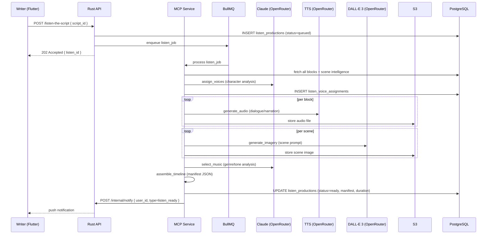

# story-042 — Listen the Script

| Field | Value |
|---|---|
| **Story ID** | story-042 |
| **Title** | Listen the Script |
| **Epic** | E10 — Social Platform |
| **Phase** | 3 |
| **Sprint** | Sprint 6 |
| **Priority** | P1 |
| **Status** | DRAFT |
| **Persona** | Priya (the professional TV writer) / Vikram (the producer) |
| **Estimated Effort** | 6 days |
| **Dependencies** | story-007, story-030, story-033, story-041 |

---

## Problem Statement

Scripts are read documents. Listen the Script transforms a published screenplay into a cinematic audio-visual experience — assigning unique TTS voices to each character, generating scene imagery, selecting ambient music, and assembling everything into a timeline that readers can experience like a radio-play with visuals. This is LIPILY's most differentiating feature and a key driver of user retention and social sharing.

---

## User Story

As a writer, I want my published script to be automatically transformed into an audio-visual experience — so that producers, collaborators, and my audience can experience it in a new dimension without reading.

---

## Acceptance Criteria

**GIVEN** a writer has a published script and their tier allows Listen the Script,  
**WHEN** they click "Create Listen" on the Script Detail Page,  
**THEN** a Listen creation request is enqueued via `POST /listen-the-script` and a progress modal opens showing the 8-step pipeline; the writer is notified via push notification and in-app notification when it completes.

**GIVEN** the MCP service begins the Listen pipeline for a script,  
**WHEN** step 1 (fetch_data) runs,  
**THEN** the service fetches all blocks for the script, identifies unique characters, and counts dialogue lines per character; this data is passed to step 2.

**GIVEN** step 2 (assign_voices) runs,  
**WHEN** characters are analysed,  
**THEN** Claude is called with character names and scene intelligence character psychology data; it assigns a voice profile (voice_id, pitch, pace, accent_hint) from the available TTS voice catalogue (minimum 12 distinct voice profiles); the assignment is stored in `listen_voice_assignments`; characters with fewer than 3 lines share voices if necessary.

**GIVEN** step 3 (generate_audio) runs,  
**WHEN** TTS is called per dialogue line,  
**THEN** each dialogue block is converted to audio using the OpenRouter TTS endpoint with the assigned voice_id and pace; action blocks are converted to a neutral narrator voice; scene headings are narrated in a formal announcer voice; audio files are stored in S3 at `s3://lipily-listen/{script_id}/audio/{block_id}.mp3`.

**GIVEN** step 4 (generate_imagery) runs,  
**WHEN** scene images are generated,  
**THEN** DALL-E 3 via OpenRouter generates one image per scene using the scene heading + first action line as the prompt; the prompt is prefixed with "Cinematic wide shot, film still, no text, no watermarks:"; images are stored at `s3://lipily-listen/{script_id}/imagery/{scene_index}.webp` at 1280×720px.

**GIVEN** step 5 (select_music) runs,  
**WHEN** the ambient music track is selected,  
**THEN** Claude analyses the script's genre, emotional arc (from Scene Intelligence), and tone; it selects one track from LIPILY's licensed ambient music library (stored in S3, minimum 20 tracks across genres); the selected track_id is stored in `listen_productions.music_track_id`; there is no third-party music API call at runtime (all music is pre-cleared).

**GIVEN** step 6 (assemble_timeline) runs,  
**WHEN** the timeline is assembled,  
**THEN** each block type is assigned a timeline entry: scene headings get 2s pause + narrator audio + scene image displayed; dialogue blocks get character voice audio + character name displayed; action blocks get narrator audio + previous scene image maintained; page break positions are used for image transitions; the final timeline manifest is a JSON structure stored in `listen_productions.timeline_manifest`.

**GIVEN** step 7 (finalize) runs,  
**WHEN** the timeline manifest is validated,  
**THEN** the system verifies all S3 audio files are present, all imagery files are present, total duration is computed and stored; `listen_productions.status = 'ready'` is set; total duration in seconds is stored in `listen_productions.duration_seconds`.

**GIVEN** step 8 (publish) completes,  
**WHEN** the Listen is ready,  
**THEN** the script detail page shows a "▶ Listen" button; the writer receives an in-app and push notification: "Your Listen is ready! Share it with the world."

**GIVEN** a visitor clicks "▶ Listen" on a script detail page,  
**WHEN** the Listen player loads,  
**THEN** the player shows: full-screen scene image (transitions on scene change), character name overlay during dialogue, progress bar, current block text (as subtitle-style caption), volume control, play/pause, 15s rewind; music plays at 20% volume underneath the TTS voices.

**GIVEN** a Free tier writer requests Listen,  
**WHEN** they attempt more than 1 Listen per month,  
**THEN** a paywall shows: "You've used your 1 free Listen this month. Upgrade to Pro for 10 Listens/month or Studio for unlimited."

---

## Listen Pipeline Mermaid Diagram



---

## Performance Criteria

- Listen pipeline for a 90-page script: < 15 minutes end-to-end
- Listen player initial load (manifest fetch + first audio chunk): < 3 seconds
- Audio buffering: pre-buffer 30 seconds of audio ahead of playback position
- TTS generation: batched 10 blocks per API call where the TTS provider supports batching

---

## Offline Behaviour

- Listen player is not available offline in Phase 3 (audio streams from S3)
- Phase 4 option: allow download for offline playback (Studio tier only)

---

## Mobile Behaviour (375px)

- Listen player: full-screen landscape-optimised; portrait mode shows image top half, captions bottom half
- Scene image: full bleed to screen edges
- Caption text: 16sp, white with 50% black background pill
- Progress bar: 4dp height, touch target 44dp

---

## Error States

**E1 — Pipeline Failure (any step)**  
`listen_productions.status = 'failed'`; writer notified: "Your Listen generation encountered an issue. We'll retry automatically in 1 hour. If this persists, contact support."; automatic retry up to 3 times with exponential backoff.

**E2 — TTS Voice Unavailable**  
If OpenRouter TTS is unavailable for a voice: fall back to the default narrator voice for that block; log to Sentry.

**E3 — DALL-E 3 Content Policy Block**  
If an image prompt is blocked: use a generic cinematic fallback image (one of 10 pre-stored generic film-set images in S3); do not fail the pipeline.

**E4 — Listen Player Network Loss Mid-Playback**  
Player pauses with a toast: "Connection lost. Audio will resume when you're back online."

---

## Security Considerations

- Listen production can only be created by the script owner (RLS)
- S3 audio files are served via pre-signed URLs with 4-hour expiry to prevent hotlinking
- The public Listen player only shows scripts that are `is_published = true`
- TTS content uses the script text — no additional AI-generated text is inserted (Human Authorship Principle)

---

## Human Authorship Considerations

- TTS renders the writer's exact words — no AI rewrites of dialogue
- AI only assists in voice assignment and music selection (curation, not creation)
- Scene imagery is generative, and carries a "AI-generated imagery" disclosure label in the player

---

## DB Tables Touched

- `listen_productions` (INSERT/UPDATE)
- `listen_voice_assignments` (INSERT)
- `script_publications` (UPDATE `listen_play_count`)

```sql
CREATE TABLE listen_productions (
  id UUID PRIMARY KEY DEFAULT gen_random_uuid(),
  script_id UUID NOT NULL REFERENCES scripts(id) ON DELETE CASCADE,
  user_id UUID NOT NULL REFERENCES profiles(id),
  status TEXT NOT NULL DEFAULT 'queued',
  timeline_manifest JSONB,
  duration_seconds INT,
  music_track_id TEXT,
  retry_count INT NOT NULL DEFAULT 0,
  error_message TEXT,
  created_at TIMESTAMPTZ NOT NULL DEFAULT NOW(),
  completed_at TIMESTAMPTZ,
  UNIQUE(script_id)
);

CREATE TABLE listen_voice_assignments (
  id UUID PRIMARY KEY DEFAULT gen_random_uuid(),
  listen_id UUID NOT NULL REFERENCES listen_productions(id) ON DELETE CASCADE,
  character_name TEXT NOT NULL,
  voice_id TEXT NOT NULL,
  pitch FLOAT NOT NULL DEFAULT 1.0,
  pace FLOAT NOT NULL DEFAULT 1.0,
  accent_hint TEXT
);
```

---

## API Endpoints Used

- `POST /listen-the-script` — enqueue Listen pipeline
- `GET /listen/:id` — get Listen production status and manifest
- `DELETE /listen/:id` — delete Listen production (owner only)
- `POST /internal/listen-pipeline-step` — MCP → Rust internal callback (service-to-service key)

---

## Test Cases

**TC-001:** Enqueue Listen for 90-page script → pipeline completes within 15 min; status becomes 'ready'.  
**TC-002:** Voice assignment → each unique character gets a distinct voice_id from the catalogue.  
**TC-003:** DALL-E 3 block → one image generated per scene; stored in S3 at correct path.  
**TC-004:** Pipeline step failure → status becomes 'failed'; auto-retry after 1 hour.  
**TC-005:** Listen player loads → first audio chunk plays within 3s.  
**TC-006:** Scene image transitions on scene change during playback.  
**TC-007:** Free tier → second Listen request in same month shows paywall.  
**TC-008:** Unpublished script → Listen player returns 404.

---

## Out of Scope

- Offline Listen download (Phase 4)
- Writer-customised voice selection (Phase 4)
- Multi-language Listen (Phase 4)
